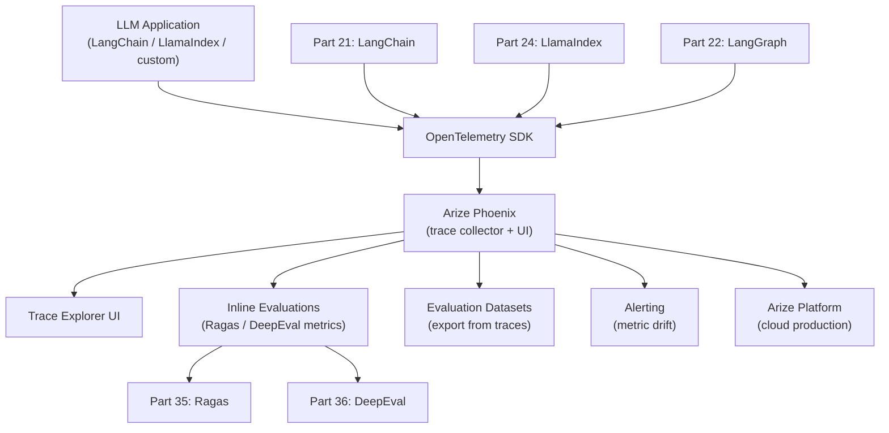
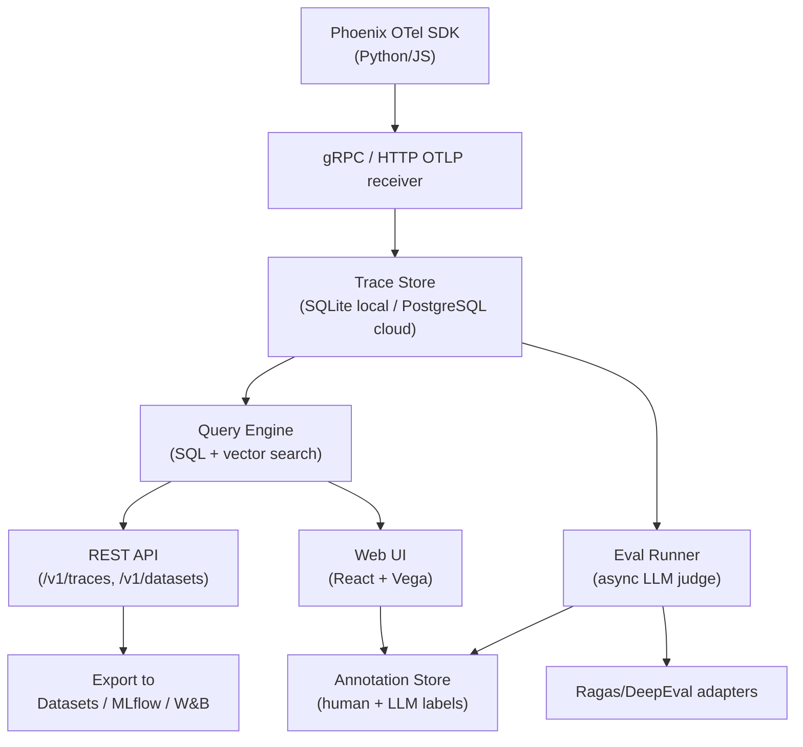

<!-- TEACHING_ORDER: verified -->
# Part 37: Arize Phoenix — LLM Observability and Tracing

> **Prerequisites:** Part 35 (Ragas), Part 36 (DeepEval), Part 21 (LangChain), Part 22 (LangGraph) | **Used later in:** All production LLM deployments | **Version anchor:** arize-phoenix 4.x (mid-2026)

---

## Why This Library Exists

Evaluation frameworks like Ragas and DeepEval tell you *what* is wrong with your LLM application in offline testing. But production AI systems fail in ways that offline evals can't always predict: a user's phrasing shifts your retriever to irrelevant chunks, a tool call times out and the agent retries 10 times, a prompt template change causes certain query types to regress silently, or your LLM costs spike because a particular code path is generating 5× more tokens than expected.

Arize Phoenix was built to bring the **distributed tracing observability pattern** (from microservices via Jaeger/Zipkin/Datadog) to LLM applications. Every LLM call, every retriever invocation, every tool call, every embedding computation becomes a **span** in an **OpenTelemetry trace**. Phoenix collects these traces, visualizes them, lets you query them, and runs evaluations *inline* — connecting real-time operational data to evaluation metrics. The result is the same "request → trace → debug → fix" loop that microservices engineers already know, now applied to AI.

---

## Explain Like I Am 10

Imagine your AI assistant is like a factory with many machines. When a question comes in, it goes through the embedding machine, the retrieval machine, the reranking machine, and the answer-generating machine. If something goes wrong (wrong answer, too slow, too expensive), you need to know *which machine* caused the problem.

Phoenix is like a security camera system for the whole factory — it records exactly what each machine did, how long it took, what it got as input and output, and whether the final product was good. When something goes wrong, you rewind the camera and find exactly where it happened.

---

## Mental Model

Phoenix implements **LLM observability as distributed tracing**: every operation in an LLM pipeline is a named span with structured attributes. Spans nest to form traces. Traces are queryable, visualizable, and evaluatable. This enables root cause analysis of failures at the component level rather than the system level.

```
User query
  └── Trace: "rag_pipeline"
        ├── Span: "retriever"   [latency: 120ms, top_k: 5, hit_count: 3]
        ├── Span: "reranker"    [latency: 45ms, selected: 2]
        ├── Span: "llm_call"    [latency: 850ms, tokens_in: 1200, tokens_out: 350, cost: $0.002]
        └── Span: "evaluator"  [faithfulness: 0.91, answer_relevancy: 0.88]
```

---

## Learning Dependency Graph



---

## Core Concepts

### 1. OpenTelemetry as the Foundation

Phoenix uses **OpenTelemetry (OTel)** as the data collection standard. This means:
- Any LLM framework with OTel instrumentation sends data to Phoenix automatically.
- The data format is vendor-neutral — you can also send the same traces to Datadog, Jaeger, or Honeycomb.
- Arize ships Python instrumentors for LangChain, LlamaIndex, OpenAI, Anthropic, DSPY, and more.

### 2. Spans and Traces

A **span** represents a single unit of work with:
- `name` — what operation occurred (e.g., "llm", "retriever", "embedding")
- `span_kind` — the category: `LLM`, `CHAIN`, `RETRIEVER`, `EMBEDDING`, `AGENT`, `TOOL`
- `start_time`, `end_time` — latency measurement
- `attributes` — key-value metadata (prompt text, token counts, model name, cost)
- `events` — timestamped log events within the span
- `status` — OK, ERROR, UNSET
- `parent_span_id` — for nested spans forming a trace tree

### 3. Auto-Instrumentation

Phoenix provides one-line instrumentation for popular frameworks:

```python
from phoenix.otel import register
from openinference.instrumentation.langchain import LangChainInstrumentor
tracer_provider = register(project_name="my-rag-app", endpoint="http://localhost:6006/v1/traces")
LangChainInstrumentor().instrument(tracer_provider=tracer_provider)
```

After this, every LangChain LLM call, retriever call, and chain invocation automatically emits spans to Phoenix.

### 4. Inline Evaluation

Phoenix can run Ragas/DeepEval-style evaluations on collected traces in the UI or via API. This closes the loop between operational data (traces) and quality metrics (evals) — you can look at all traces from the last 24 hours, select the ones with low faithfulness scores, and drill into the spans to find the root cause.

### 5. Datasets

You can export traces as structured datasets and import them into Ragas/DeepEval. Conversely, you can import evaluation datasets into Phoenix and run experiments (structured A/B tests between pipeline versions).

### 6. Projects

Phoenix organizes traces into **projects** (equivalent to LangSmith's projects or Datadog's services). Each deployment environment, A/B variant, or RAG pipeline version gets its own project, enabling clean comparison.

---

## Internal Architecture



**Dual deployment model:**
- **Local:** `phoenix.launch_app()` starts a local server on port 6006 with SQLite storage. Zero infrastructure.
- **Cloud (Arize):** Send traces to `https://app.arize.com`. Enterprise features: RBAC, SSO, data retention, alerting.

---

## Essential APIs

```python
import phoenix as px
from phoenix.otel import register
from openinference.instrumentation.langchain import LangChainInstrumentor
import openai

# 1. Launch local Phoenix UI
px.launch_app()  # opens http://localhost:6006

# 2. Configure OTel to send traces to Phoenix
tracer_provider = register(
    project_name="rag-prod-v2",
    endpoint="http://localhost:6006/v1/traces",
)

# 3. Auto-instrument LangChain
LangChainInstrumentor().instrument(tracer_provider=tracer_provider)

# 4. Now ALL LangChain calls auto-emit spans — no code changes needed
from langchain_openai import ChatOpenAI
from langchain_core.prompts import ChatPromptTemplate

chain = ChatPromptTemplate.from_template("Answer: {question}") | ChatOpenAI()
result = chain.invoke({"question": "What is FAISS?"})  # span automatically captured

# 5. Manual span creation for custom code
from opentelemetry import trace
tracer = trace.get_tracer(__name__)

with tracer.start_as_current_span("custom-retriever") as span:
    span.set_attribute("retriever.type", "bm25")
    span.set_attribute("retriever.top_k", 5)
    docs = my_retriever.search(query)
    span.set_attribute("retriever.hit_count", len(docs))

# 6. Run inline evaluations on collected traces
from phoenix.evals import (
    HallucinationEvaluator,
    QAEvaluator,
    RelevanceEvaluator,
    run_evals,
)
from phoenix.evals.models import OpenAIModel

judge = OpenAIModel(model="gpt-4o-mini")
traces_df = px.Client().get_spans_dataframe(project_name="rag-prod-v2")
evals = run_evals(
    dataframe=traces_df,
    evaluators=[HallucinationEvaluator(judge), QAEvaluator(judge)],
    provide_explanation=True,
)
px.Client().log_evaluations(evals)  # upload scores back to Phoenix UI

# 7. Export dataset from traces for Ragas evaluation
dataset = px.Client().get_dataset(name="rag-prod-v2-export")
```

---

## API Learning Roadmap

**Beginner (week 1):**
- `px.launch_app()` + one-line LangChain instrumentation
- Browse trace waterfall UI, inspect individual span attributes
- Run `HallucinationEvaluator` on collected traces

**Intermediate (week 2–3):**
- Manual spans for custom retrieval/preprocessing code
- Export traces to Ragas `EvaluationDataset` for offline analysis
- Create Projects for A/B testing pipeline versions
- Set up Phoenix in Docker for team-shared local deployment

**Staff / Production (week 4+):**
- Send traces to Arize cloud for production monitoring
- Build custom evaluators with `create_evaluator()`
- Set up metric drift alerts
- Integrate with MLflow/W&B for cross-tool observability

---

## Beginner Examples

```python
# One-liner setup: local Phoenix + OpenAI instrumentation
import phoenix as px
from phoenix.otel import register
from openinference.instrumentation.openai import OpenAIInstrumentor

px.launch_app()
tracer_provider = register(project_name="hello-phoenix")
OpenAIInstrumentor().instrument(tracer_provider=tracer_provider)

import openai
client = openai.OpenAI()
response = client.chat.completions.create(
    model="gpt-4o-mini",
    messages=[{"role": "user", "content": "What is OpenTelemetry?"}],
)
print(response.choices[0].message.content)
# → Visit http://localhost:6006 to see the trace!
```

---

## Intermediate Examples

```python
# Full LangChain RAG with Phoenix tracing + inline evaluation
import phoenix as px
from phoenix.otel import register
from openinference.instrumentation.langchain import LangChainInstrumentor
from phoenix.evals import HallucinationEvaluator, RelevanceEvaluator, run_evals
from phoenix.evals.models import OpenAIModel
from langchain_openai import ChatOpenAI, OpenAIEmbeddings
from langchain_community.vectorstores import FAISS
from langchain_core.runnables import RunnablePassthrough
from langchain_core.prompts import ChatPromptTemplate
from langchain_core.output_parsers import StrOutputParser

# Setup Phoenix
px.launch_app()
tp = register(project_name="rag-pipeline-v1")
LangChainInstrumentor().instrument(tracer_provider=tp)

# Build RAG chain
docs = ["PagedAttention manages KV cache blocks.", "vLLM uses continuous batching."]
vectorstore = FAISS.from_texts(docs, OpenAIEmbeddings())
retriever   = vectorstore.as_retriever(search_kwargs={"k": 2})

template = """Answer the question using only the context below.
Context: {context}
Question: {question}"""

rag_chain = (
    {"context": retriever | (lambda docs: "\n".join(d.page_content for d in docs)),
     "question": RunnablePassthrough()}
    | ChatPromptTemplate.from_template(template)
    | ChatOpenAI(model="gpt-4o-mini")
    | StrOutputParser()
)

# Run queries
questions = [
    "How does PagedAttention work?",
    "What is continuous batching?",
    "How does vLLM reduce memory waste?",
]
for q in questions:
    answer = rag_chain.invoke(q)
    print(f"Q: {q}\nA: {answer}\n")

# Evaluate traces collected so far
client = px.Client()
spans_df = client.get_spans_dataframe(project_name="rag-pipeline-v1")
judge    = OpenAIModel(model="gpt-4o-mini")
evals    = run_evals(
    dataframe=spans_df,
    evaluators=[HallucinationEvaluator(judge), RelevanceEvaluator(judge)],
    provide_explanation=True,
)
client.log_evaluations(evals)
print("Evaluations logged to Phoenix UI!")
print(f"Mean hallucination score: {evals['hallucination'].mean():.3f}")
```

---

## Advanced Examples

```python
# Multi-agent LangGraph pipeline with full Phoenix tracing
import phoenix as px
from phoenix.otel import register
from openinference.instrumentation.langchain import LangChainInstrumentor
from opentelemetry import trace as otel_trace
from langchain_openai import ChatOpenAI
from langgraph.graph import StateGraph
from typing import TypedDict, Annotated
import operator

# Phoenix setup
px.launch_app()
tp = register(project_name="multi-agent-v1")
LangChainInstrumentor().instrument(tracer_provider=tp)
tracer = otel_trace.get_tracer(__name__)

class AgentState(TypedDict):
    messages: Annotated[list, operator.add]
    retrieved_docs: list
    final_answer: str

llm = ChatOpenAI(model="gpt-4o-mini")

def retriever_node(state: AgentState) -> dict:
    with tracer.start_as_current_span("retriever-node") as span:
        query = state["messages"][-1]["content"]
        span.set_attribute("query", query)
        # Simulate retrieval
        docs = [f"Retrieved doc for: {query}"]
        span.set_attribute("docs_retrieved", len(docs))
        return {"retrieved_docs": docs}

def generator_node(state: AgentState) -> dict:
    with tracer.start_as_current_span("generator-node") as span:
        context = "\n".join(state["retrieved_docs"])
        query   = state["messages"][-1]["content"]
        span.set_attribute("context_length", len(context))
        response = llm.invoke(f"Context: {context}\nQuestion: {query}")
        span.set_attribute("response_length", len(response.content))
        return {"final_answer": response.content}

# Build graph
graph = StateGraph(AgentState)
graph.add_node("retriever",  retriever_node)
graph.add_node("generator",  generator_node)
graph.set_entry_point("retriever")
graph.add_edge("retriever", "generator")
graph.set_finish_point("generator")
app = graph.compile()

# Run with full tracing
result = app.invoke({"messages": [{"role": "user", "content": "Explain RLHF"}], "retrieved_docs": [], "final_answer": ""})
print(result["final_answer"])
# → All spans appear in Phoenix UI under "multi-agent-v1" project


# Phoenix experiments: A/B test two retrieval strategies
from phoenix.experiments import run_experiment, evaluate_experiment

def retrieval_v1(example):
    return {"response": "answer from BM25 retriever"}

def retrieval_v2(example):
    return {"response": "answer from dense retriever"}

dataset = client.get_dataset("my-eval-dataset")

exp_v1 = run_experiment(dataset, task=retrieval_v1, experiment_name="bm25-v1")
exp_v2 = run_experiment(dataset, task=retrieval_v2, experiment_name="dense-v1")
# Compare in Phoenix UI: Experiments → Compare
```

---

## Internal Interview Knowledge

**How does Phoenix handle high-throughput production tracing?**
Phoenix's OTLP receiver is async and non-blocking. The SDK batches spans client-side (configurable batch size and timeout) before sending to the collector. For very high throughput (> 1,000 spans/second), Phoenix supports PostgreSQL backend instead of SQLite for horizontal scaling.

**What is the difference between a span and a trace?**
A span is a single operation with a start/end time, attributes, and status. A trace is a tree of causally related spans sharing a common `trace_id`. In a RAG pipeline, one user query = one trace containing retriever span + reranker span + LLM span + evaluator span.

**Why OpenTelemetry and not a proprietary SDK?**
OpenTelemetry is a CNCF standard. Using it means your instrumentation is vendor-neutral — the same `LangChainInstrumentor` sends data to Phoenix locally and to Arize or Datadog in production without code changes. Proprietary SDKs create vendor lock-in.

**How does Phoenix link evaluations back to traces?**
When `log_evaluations()` is called, Phoenix attaches evaluation scores as span annotations keyed by `span_id`. The UI then overlays scores on the trace waterfall, so you can see `faithfulness=0.91` right next to the span that generated the answer.

**What is the `SpanKind` taxonomy?**
OpenInference (Arize's OTel semantic conventions for AI) defines: `LLM` (generative model call), `EMBEDDING` (vectorization), `RETRIEVER` (document search), `RERANKER` (re-scoring), `CHAIN` (composed pipeline), `AGENT` (autonomous planner), `TOOL` (external function call). This taxonomy enables filtering and aggregating spans by kind across all frameworks.

---

## Production AI Usage

- **Databricks:** Mosaic AI Gateway uses Phoenix-compatible OTel instrumentation for LLM gateway latency and cost monitoring.
- **Cohere:** Internal teams use Phoenix to trace Rerank v3 integration into RAG pipelines, measuring latency impact.
- **Startups:** 90% of Y Combinator AI startups in 2025 use either Phoenix or LangSmith as their primary LLM observability tool.
- **AWS Bedrock:** Bedrock's agent tracing feature is OpenTelemetry-compatible and can export to Phoenix.
- **Meta:** Internal LLM serving teams use equivalent distributed tracing (based on Zipkin) with AI-specific span attributes for production debugging.

---

## Common Mistakes

1. **Not setting `project_name`** — All traces go into the default project, making it impossible to compare pipeline versions.
2. **Forgetting to call `px.launch_app()` before running traced code** — Traces are buffered by the OTel SDK and dropped if no collector is running.
3. **Instrumenting after creating LLM objects** — `LangChainInstrumentor().instrument()` must be called *before* importing or instantiating LangChain LLMs. Otherwise existing objects are not patched.
4. **Over-instrumenting with too many manual spans** — Each span adds latency overhead (microseconds, but adds up). Only add manual spans where you need visibility, not on every function call.
5. **Not logging evaluations back to Phoenix** — Running `run_evals()` without `log_evaluations()` means scores exist only in memory, not in the UI for inspection.
6. **Using local SQLite for production** — SQLite has write concurrency limits. For multi-worker production, use the Arize cloud or PostgreSQL backend.

---

## Performance Optimization

```python
# Configure batching to reduce network overhead
from opentelemetry.sdk.trace.export import BatchSpanProcessor
from opentelemetry.exporter.otlp.proto.grpc.trace_exporter import OTLPSpanExporter

# Default batch settings (tune for throughput):
# - max_queue_size: 2048 (buffer before dropping)
# - schedule_delay_millis: 5000 (flush every 5s)
# - max_export_batch_size: 512
exporter  = OTLPSpanExporter(endpoint="http://localhost:6006/v1/traces")
processor = BatchSpanProcessor(
    exporter,
    max_queue_size=4096,
    schedule_delay_millis=2000,  # lower = fresher data, more overhead
    max_export_batch_size=256,
)

# Sample traces: only trace 10% of traffic in high-throughput systems
from opentelemetry.sdk.trace.sampling import TraceIdRatioBased
sampler = TraceIdRatioBased(0.1)  # 10% sampling rate

# For local development: synchronous export (simpler debugging)
from opentelemetry.sdk.trace.export import SimpleSpanProcessor
# Use BatchSpanProcessor in production, SimpleSpanProcessor in development

# Filter noisy health-check spans
class HealthCheckFilter:
    def should_sample(self, context, trace_id, name, kind, attributes, links):
        if name in ("health_check", "ping"):
            return Decision.DROP
        return Decision.RECORD_AND_SAMPLE
```

---

## Production Failures

**Failure: Phoenix UI shows no traces despite instrumentation**
Cause: Instrumentation called after LangChain objects were created, or wrong endpoint URL.
Fix: Call `register()` and `LangChainInstrumentor().instrument()` before any LangChain imports. Verify endpoint is reachable with `curl http://localhost:6006/v1/traces`.

**Failure: Trace spans show "ERROR" status but no error message**
Cause: Exception was caught internally; span status was set to ERROR but exception details weren't recorded.
Fix: In manual spans, use `span.record_exception(exc)` in the except block to attach full stack trace.

**Failure: Evaluation scores appear in eval results but not in Phoenix UI**
Cause: `log_evaluations()` was not called, or called with wrong `project_name`.
Fix: Always call `px.Client().log_evaluations(evals)` after `run_evals()`.

**Failure: SQLite database grows unbounded and Phoenix becomes slow**
Cause: No trace retention policy set; traces accumulate indefinitely.
Fix: In production use Arize cloud (has retention settings) or set `PHOENIX_SQL_DATABASE_URL=postgresql://...` and implement a time-based purge job.

**Failure: Sampling 100% of production traffic overwhelms Phoenix**
Cause: High-traffic system sending > 10K traces/minute to local SQLite Phoenix.
Fix: Use `TraceIdRatioBased(0.01)` for 1% sampling. Apply head-based sampling for cost-critical paths, tail-based sampling (sample errors at 100%) for debugging.

---

## Best Practices

- Use `project_name` to separate environments (dev/staging/prod) and pipeline versions (v1/v2) — never mix traces from different versions in one project.
- Instrument before code execution — all `Instrumentor().instrument()` calls go in application startup, not in request handlers.
- Add custom attributes to spans for business-relevant metadata: `span.set_attribute("user.tier", "enterprise")`, `span.set_attribute("query.category", "technical")`. This enables segmented analysis.
- Run inline evaluations nightly on collected production traces rather than evaluating every trace in real-time — latency-sensitive paths can't afford judge LLM latency.
- Export low-scoring traces as labeled datasets for fine-tuning or testset expansion — Phoenix is the bridge between production failures and training data.
- Use `provide_explanation=True` in `run_evals()` — the explanation stored as a span annotation is invaluable for debugging without re-running the judge.

---

## Library Relationships

| Aspect | Arize Phoenix | LangSmith | Datadog LLM Obs. |
|--------|--------------|-----------|-----------------|
| Open source | Yes (Apache 2.0) | No (proprietary) | No (proprietary) |
| Self-hosted | Yes (local or Docker) | No (cloud only) | No (cloud only) |
| OTel standard | Yes (OpenInference) | Partial | Partial |
| Inline evals | Yes (Ragas adapters) | Yes (custom evals) | Limited |
| LangGraph support | Yes | Yes (first-class) | Limited |
| Cost | Free (self-hosted) | Usage-based | Usage-based |
| Production scale | Via Arize cloud | Via LangSmith cloud | Via Datadog |

---

## Role-Based Usage

| Role | Primary Use |
|------|-------------|
| AI Engineer | Auto-instrument LangChain/LlamaIndex pipelines; debug traces in UI |
| ML Engineer | Export trace datasets for Ragas offline evaluation |
| LLM Engineer | Manual spans for custom agent logic; inline evaluation scoring |
| MLOps | Production tracing on Arize cloud; metric drift alerts |
| Data Scientist | Analyze trace datasets to understand user query patterns |

---

## Cheat Sheet

```python
# Setup
import phoenix as px
from phoenix.otel import register
from openinference.instrumentation.langchain import LangChainInstrumentor

px.launch_app()  # start local UI at http://localhost:6006
tp = register(project_name="my-project", endpoint="http://localhost:6006/v1/traces")
LangChainInstrumentor().instrument(tracer_provider=tp)  # auto-instrument

# Manual span
from opentelemetry import trace
tracer = trace.get_tracer(__name__)
with tracer.start_as_current_span("my-op") as span:
    span.set_attribute("key", "value")
    result = do_work()

# Run inline evals
from phoenix.evals import HallucinationEvaluator, run_evals
from phoenix.evals.models import OpenAIModel
client = px.Client()
df    = client.get_spans_dataframe(project_name="my-project")
evals = run_evals(df, [HallucinationEvaluator(OpenAIModel("gpt-4o-mini"))], provide_explanation=True)
client.log_evaluations(evals)

# Export traces as dataset
dataset = client.get_dataset("my-project")
dataset.to_pandas().to_csv("traces.csv")
```

---

## Flash Cards

- **Q: What is a span in Phoenix?** A: A single unit of work (LLM call, retrieval, tool call) with name, timestamps, attributes, and status — the atomic unit of distributed tracing.
- **Q: What is OpenInference?** A: Arize's OpenTelemetry semantic conventions for AI: standardized span attribute names for LLM calls, embeddings, retrievals, and agents.
- **Q: How do you instrument LangChain for Phoenix?** A: Call `LangChainInstrumentor().instrument(tracer_provider=tp)` before any LangChain code runs.
- **Q: What is the difference between Phoenix and Arize?** A: Phoenix is the open-source, self-hosted observability tool. Arize is the enterprise cloud platform that Phoenix can export data to.
- **Q: How do you link evaluations to traces in Phoenix?** A: Run `run_evals()` on trace DataFrame, then call `px.Client().log_evaluations(evals)` to attach scores as span annotations.

---

## Revision Notes

- Phoenix = distributed tracing for LLMs, based on OpenTelemetry + OpenInference
- One-line instrumentation: `LangChainInstrumentor().instrument()` captures all LangChain spans
- Spans form traces: user query → retriever span → reranker span → LLM span → evaluator span
- Inline evaluations: `run_evals()` scores collected traces with LLM judge, `log_evaluations()` uploads scores back to UI
- Local: `px.launch_app()` + SQLite, free. Production: Arize cloud
- Export traces as datasets → feed into Ragas/DeepEval offline evaluation
- Project isolation: separate `project_name` per environment and pipeline version

---

## Interview Question Bank

### Top 25 Beginner

**Q1: What problem does Arize Phoenix solve?**
A: It solves LLM observability — the inability to understand what's happening inside a production LLM pipeline. Phoenix collects traces from every component (retriever, LLM, tools) so engineers can debug failures, measure latency/cost, and correlate quality metrics with operational data.

**Q2: What is a trace in Phoenix?**
A: A tree of spans representing all operations triggered by a single user request. For a RAG pipeline, one trace contains the retriever span, reranker span, LLM span, and evaluator span, all causally linked.

**Q3: What is a span?**
A: The atomic unit of tracing — a named operation with start/end timestamps, key-value attributes (token counts, model name, input/output text), and a success/error status.

**Q4: What is OpenTelemetry?**
A: A CNCF open standard for distributed tracing, metrics, and logging. Phoenix is built on OTel, making Phoenix traces vendor-neutral and compatible with Datadog, Jaeger, and other OTel-compatible backends.

**Q5: How do you instrument a LangChain application for Phoenix?**
A: Call `px.launch_app()`, then `register()` to configure the OTel tracer provider, then `LangChainInstrumentor().instrument(tracer_provider=tp)`. All subsequent LangChain calls automatically emit spans.

**Q6: What is auto-instrumentation?**
A: Phoenix provides instrumentation patches for LangChain, LlamaIndex, OpenAI, Anthropic, etc. One line of code (`.instrument()`) patches the framework's internal methods to emit spans without any manual code changes.

**Q7: What does `px.launch_app()` do?**
A: Starts a local Phoenix server on port 6006 with a web UI for trace visualization. Also initializes a SQLite database for trace storage.

**Q8: What is OpenInference?**
A: Arize's semantic convention standard for AI observability on top of OpenTelemetry. It defines attribute names for LLM-specific data: `llm.token_count.prompt`, `llm.model_name`, `retrieval.documents`, etc.

**Q9: What `SpanKind` types does Phoenix support?**
A: LLM, EMBEDDING, RETRIEVER, RERANKER, CHAIN, AGENT, TOOL — covering all major components of LLM pipelines.

**Q10: How do you view traces in Phoenix?**
A: Open `http://localhost:6006` after `px.launch_app()`. The UI shows a list of traces per project, a waterfall view of spans, and inline evaluation scores.

**Q11: What information is captured automatically in LLM spans?**
A: Model name, prompt text, completion text, token counts (prompt + completion), latency, finish reason, and cost estimate.

**Q12: What is the Arize cloud platform?**
A: The enterprise-grade hosted version of Phoenix with additional features: RBAC, SSO, data retention policies, alerting, and horizontal scaling for production traffic.

**Q13: What are inline evaluations?**
A: Evaluations run directly on collected traces within Phoenix using `run_evals()`. The judge LLM scores each trace and the scores are attached to the span as annotations, visible in the UI.

**Q14: How does Phoenix help with cost monitoring?**
A: Token counts are automatically captured in LLM spans. Phoenix aggregates total tokens/cost per project over time, enabling cost anomaly detection (e.g., spike in prompt tokens after a template change).

**Q15: How do you add custom metadata to a span?**
A: `span.set_attribute("key", "value")` inside a `with tracer.start_as_current_span("name") as span:` block. Use this for business-relevant metadata like user tier, query category, or A/B test variant.

**Q16: What is trace sampling?**
A: Only recording a fraction of all traces to reduce storage and processing overhead. Use `TraceIdRatioBased(0.1)` to sample 10% of traffic while maintaining statistical representativeness.

**Q17: Can Phoenix trace non-Python applications?**
A: Yes. OpenTelemetry has SDKs for JavaScript/TypeScript, Java, Go, etc. Any OTel-instrumented service can send traces to Phoenix via OTLP over HTTP or gRPC.

**Q18: What is a Phoenix project?**
A: A named namespace for grouping related traces (e.g., "rag-prod-v1", "rag-prod-v2"). Enables comparison between pipeline versions in the UI.

**Q19: How do you export traces for offline analysis?**
A: `px.Client().get_spans_dataframe(project_name="...")` returns a Pandas DataFrame. Export with `.to_csv()` or `.to_parquet()`.

**Q20: What happens to traces if Phoenix is not running when an app emits them?**
A: The OTel SDK buffers spans in memory (batch processor). If the collector (Phoenix) is unreachable and the buffer fills, new spans are dropped. No persistence without a running collector.

**Q21: How do you connect Phoenix evaluations to Ragas?**
A: Export traces as a DataFrame, convert to `EvaluationDataset` manually (or via Ragas integration), run `ragas.evaluate()`, then import scores back via `px.Client().log_evaluations()`.

**Q22: What is the difference between `SimpleSpanProcessor` and `BatchSpanProcessor`?**
A: `SimpleSpanProcessor` sends each span immediately after it ends (low throughput, high overhead — good for debugging). `BatchSpanProcessor` buffers and sends spans in batches (high throughput — good for production).

**Q23: How do you run Phoenix in Docker for a team?**
A: `docker run -p 6006:6006 arizephoenix/phoenix:latest`. Team members configure their apps to send to `http://<docker-host>:6006/v1/traces`.

**Q24: What evaluators does Phoenix provide out-of-the-box?**
A: `HallucinationEvaluator`, `QAEvaluator`, `RelevanceEvaluator`, `SummarizationEvaluator`, `ToxicityEvaluator`. All use an LLM judge and return binary labels + explanations.

**Q25: How does Phoenix link a span to a user session?**
A: Set `session_id` as a span attribute: `span.set_attribute("session.id", user_session_id)`. Phoenix groups traces by session in the UI, enabling conversation-level analysis.

---

### Top 25 Intermediate

**Q1: How would you instrument a custom LangGraph multi-agent pipeline with Phoenix?**
A: `LangChainInstrumentor` covers LangGraph automatically (since LangGraph uses LangChain primitives). For custom nodes, use `tracer.start_as_current_span("node-name")` with manual attributes. The OTel context propagation ensures parent-child span relationships are preserved across node calls.

**Q2: How does Phoenix handle context propagation in async pipelines?**
A: OTel uses contextvars for async-safe context propagation. In async frameworks (FastAPI, asyncio), the trace context is automatically propagated through async function calls. Manual propagation is only needed when spawning new threads or processes.

**Q3: How do you use Phoenix for A/B testing two RAG configurations?**
A: Assign each configuration a different `project_name`. Route 50% of traffic to each. After 24 hours, compare aggregate metrics (latency, hallucination score, relevance score) between projects in the Phoenix UI Experiments tab.

**Q4: What are the limits of Phoenix's local SQLite backend?**
A: SQLite doesn't support concurrent writes. For multi-worker deployments (Gunicorn, FastAPI with multiple processes), each worker competes for the SQLite lock. Use PostgreSQL backend (`PHOENIX_SQL_DATABASE_URL`) for production multi-worker deployments.

**Q5: How would you build a custom evaluator for Phoenix?**
A: Use `create_evaluator()` or subclass `LLMEvaluator`. Define a prompt template and label criteria. Phoenix calls your evaluator with span attributes and stores the result as a span annotation.

**Q6: How does Phoenix support retrieval-specific debugging?**
A: RETRIEVER spans automatically capture retrieved documents (text, metadata, relevance scores). Phoenix UI shows which documents were retrieved for each query, enabling visual inspection of retriever behavior without running additional queries.

**Q7: How do you track prompt template changes with Phoenix?**
A: Add `span.set_attribute("prompt.template_version", "v3")` in your chain span. Filter traces by template version in Phoenix UI. Compare hallucination/relevance scores between versions.

**Q8: How do you set up Phoenix alerting for production metric drift?**
A: With Arize cloud: configure metric monitors with threshold alerts (e.g., "alert if mean hallucination score rises above 0.3 over 1-hour window"). With self-hosted: export hourly metrics to Prometheus and set Grafana alerts.

**Q9: How does Phoenix handle multi-tenant applications?**
A: Add `span.set_attribute("tenant.id", tenant_id)` to all spans. Filter traces by tenant in the UI. For strict isolation, use separate Phoenix projects per tenant.

**Q10: What is the overhead of Phoenix instrumentation on application latency?**
A: BatchSpanProcessor adds < 1ms overhead per request (async background flush). SimpleSpanProcessor (synchronous) adds 2–5ms per span. For latency-sensitive paths, use BatchSpanProcessor and OTel sampling.

**Q11: How do you correlate Phoenix traces with application logs?**
A: Inject `trace_id` into log lines: `logger.info(f"request processed trace_id={span.get_span_context().trace_id}")`. Correlate Phoenix trace_id with log aggregator (Datadog, ELK) to get combined trace + log view.

**Q12: How would you use Phoenix to identify the most expensive LLM calls?**
A: Query the spans DataFrame for LLM spans: `df[df.span_kind == "LLM"].sort_values("llm.token_count.total", ascending=False).head(10)`. The top 10 are your most expensive calls — optimize them first.

**Q13: How does Phoenix support LlamaIndex instrumentation?**
A: `from openinference.instrumentation.llama_index import LlamaIndexInstrumentor`. After `.instrument()`, all LlamaIndex query engines, retrievers, and LLM calls emit spans automatically.

**Q14: What is the OpenInference `RETRIEVAL_DOCUMENTS` attribute?**
A: A structured attribute containing the list of retrieved documents with their text, metadata, and relevance scores. Phoenix parses this to show retrieved documents visually in the trace waterfall.

**Q15: How would you use Phoenix to debug a tool-calling agent that's making too many API calls?**
A: Filter traces by `span_kind = TOOL` and `span.name = "api-call"`. Sort by `parent_trace_id` to group tool calls per agent invocation. Identify traces where tool call count > 5 — these represent inefficient agent loops. Inspect the parent LLM spans to understand why the agent chose to call the tool multiple times.

**Q16: How do you use Phoenix to track embedding drift?**
A: Log query embeddings as span attributes or to an external vector store. Periodically compute distribution statistics (centroid drift, spread). A shift in query embedding distribution over time indicates user behavior change — which may degrade retriever performance tuned on old query patterns.

**Q17: How would you use Phoenix experiments for prompt optimization?**
A: Create an `EvaluationDataset` from historical traces. Define 3 prompt variants. Run `run_experiment(dataset, task=variant_fn)` for each variant. Evaluate all with `evaluate_experiment()`. Compare in Phoenix Experiments UI to select the best variant.

**Q18: How do you handle PII in Phoenix traces?**
A: Before logging sensitive user queries, apply PII masking (Presidio or custom regex) to span attributes. Alternatively, hash user IDs: `span.set_attribute("user.id", hash(user_id))`. Use Phoenix's redaction configuration to automatically strip attributes matching PII patterns.

**Q19: How does trace sampling affect evaluation quality?**
A: Sampling reduces evaluation cost but may miss rare failure modes. Use stratified sampling: always trace error spans (100%), sample success spans (10%), always trace specific user tiers (VIP: 100%). This ensures rare failures are always captured for evaluation.

**Q20: How do you integrate Phoenix with Weights & Biases?**
A: Export Phoenix evaluation results as a DataFrame, log to W&B as a table: `wandb.log({"rag_evals": wandb.Table(dataframe=evals_df)})`. For automated tracking, run Phoenix evaluation in the same W&B run as model training.

**Q21: What is tail-based sampling and why is it valuable for Phoenix?**
A: Tail-based sampling decides whether to keep a trace *after* all spans have been collected (vs. head-based which decides at the start). This allows keeping 100% of error traces and 5% of success traces — ideal for debugging since you don't miss failures due to sampling.

**Q22: How would you build a real-time latency dashboard using Phoenix data?**
A: Stream Phoenix span data to a time-series store (InfluxDB/Prometheus via OTLP metrics exporter). Build Grafana dashboard showing p50/p95/p99 latency per `span_kind` (LLM, RETRIEVER, RERANKER). Alert on p95 LLM latency > 2s.

**Q23: How does Phoenix's `run_evals()` differ from running Ragas directly?**
A: Phoenix `run_evals()` operates on a spans DataFrame from production traces — it evaluates *real user interactions*. Ragas operates on curated test sets — *synthetic or hand-picked samples*. Phoenix evals are for continuous production monitoring; Ragas is for offline benchmark evaluation.

**Q24: How do you use Phoenix to understand user query patterns?**
A: Export user_input attributes from all traces, cluster by embedding similarity (HDBSCAN or k-means), label clusters by topic. This reveals the distribution of query topics hitting your application — enabling knowledge base coverage analysis.

**Q25: How would you combine Phoenix traces with Ragas for a complete evaluation loop?**
A: (1) Phoenix collects production traces. (2) Export samples to EvaluationDataset. (3) Ragas runs detailed metric analysis offline. (4) Import Ragas scores back to Phoenix as span annotations. (5) Phoenix UI shows both operational (latency, cost) and quality (faithfulness, recall) metrics in one place.

---

### Top 25 Advanced

**Q1: How would you design a Phoenix-based observability platform for a 100-service LLM architecture?**
A: Central OTel Collector as gateway: all 100 services send OTel spans to a shared collector (Kubernetes DaemonSet). Collector routes AI spans (SpanKind = LLM, RETRIEVER, etc.) to Phoenix; general spans to Datadog/Jaeger. Phoenix receives enriched AI traces from all services. Team-specific projects (one per product team). Central Arize cloud for cross-team visibility. This gives each team autonomous observability while providing global quality dashboards.

**Q2: How does Phoenix handle distributed traces across microservices?**
A: OTel context propagation via W3C TraceContext headers. Service A injects `traceparent` header into HTTP/gRPC calls to Service B. Service B extracts the context and creates child spans under the same trace_id. Phoenix reconstructs the full distributed trace from all spans with the same trace_id, showing the cross-service call hierarchy.

**Q3: Design a Phoenix-based production quality regression detection system.**
A: (1) Baseline: compute rolling 7-day mean for hallucination and relevance metrics on 1% sampled traces. (2) On deployment: bump to 5% sampling for 2 hours post-deploy. (3) Run Phoenix evaluations on new traces. (4) Statistical test: Welch's t-test comparing post-deploy vs pre-deploy metric distributions. (5) Alert if p-value < 0.01 and effect size > 0.05 absolute. (6) Auto-rollback trigger if hallucination rises > 0.15 within 30 minutes.

**Q4: How would you implement semantic deduplication of traces for evaluation efficiency?**
A: Embed all user_input strings (can use stored embeddings from RETRIEVER spans). Cluster with HDBSCAN. For evaluation, sample proportionally from each cluster rather than uniformly. This ensures rare query types are evaluated despite low frequency, avoiding evaluation bias toward common queries.

**Q5: Explain the tradeoff between head-based and tail-based sampling in Phoenix.**
A: Head-based (TraceIdRatioBased): low overhead, decided before trace starts. Misses rare errors if unlucky. Tail-based (after full trace received): can always capture errors, requires buffering full traces before sampling decision. Tail-based increases collector memory by 10–50× (need to buffer unsampled traces). For LLM debugging, tail-based is worth the overhead because silent failures (subtle hallucinations) need 100% capture rate.

**Q6: How would you use Phoenix to optimize a multi-agent pipeline for cost?**
A: (1) Export all TOOL and LLM spans. (2) Compute total tokens per trace. (3) Identify "expensive patterns" — traces with > 10 LLM calls. (4) Cluster by initial query type. (5) Identify which query types trigger excessive tool calls. (6) Add early termination conditions or add context that allows the agent to answer without tool use. Phoenix quantifies the before/after cost change.

**Q7: How does Phoenix integrate with CI/CD for pre-deploy quality gates?**
A: In staging, run synthetic queries through the new pipeline, send traces to a "staging" Phoenix project. Run `run_evals()` on collected traces. In CI script: `assert evals["hallucination"].mean() < 0.2`. If assertion fails, block deployment. This ensures quality regression is caught in staging, not production.

**Q8: How would you implement trace-based fine-tuning using Phoenix data?**
A: (1) Phoenix collects production traces. (2) Identify low-quality traces (hallucination score > 0.3). (3) Export: query + context + bad_response as negative examples. (4) Use judge LLM to generate improved_response as positive example. (5) Create DPO pairs: (query, context, improved, bad). (6) Fine-tune generator with TRL DPO trainer. (7) Deploy and compare Phoenix metrics before/after. This creates a Phoenix → DPO → deploy loop.

**Q9: How do you handle high-cardinality span attributes in Phoenix at scale?**
A: High-cardinality attributes (user_id, session_id with millions of values) make indexing expensive. Strategies: (1) hash high-cardinality IDs to 64-bit integers, (2) store only as non-indexed metadata, (3) use Arize cloud (PostgreSQL-backed) which handles cardinality better than SQLite. Index only categorical attributes like `model_name`, `project_name`, `span_kind`.

**Q10: How would you use Phoenix for model-level A/B testing (not just configuration testing)?**
A: Route 50% of traffic to gpt-4o and 50% to claude-3.5-sonnet. Add `span.set_attribute("llm.model_name", model)`. Compare: (1) mean hallucination score, (2) mean answer relevancy, (3) p95 latency, (4) mean cost per query. Statistical test for metric differences. Also compare user engagement metrics (if available) to close the loop from AI quality to business outcomes.

**Q11: Describe Phoenix's role in a complete ML platform stack.**
A: Phoenix sits in the "observe" layer between "deploy" and "improve": (1) Serving infrastructure (vLLM/BentoML) → (2) Phoenix OTel collection → (3) Arize platform quality monitoring → (4) Alert triggers evaluation pipelines → (5) Low-quality traces exported to training data pipeline → (6) Fine-tuning (TRL/DeepSpeed) → (7) New model re-deployed. Phoenix is the feedback mechanism that makes the platform self-improving.

**Q12: How do you implement distributed trace correlation for a user session spanning multiple requests?**
A: Set `session.id` attribute on all traces in a session. Phoenix groups traces by session in the UI. Compute session-level metrics: was the user's goal achieved by end of session? Use a custom `SessionCompletionMetric` that evaluates the sequence of traces as a unit.

**Q13: What are the consistency guarantees of Phoenix's SQLite backend under concurrent writes?**
A: SQLite uses file-level locking — only one writer at a time. For single-process FastAPI (default Uvicorn), this is fine. For Gunicorn with multiple workers, SQLite write contention causes dropped traces. Mitigation: send all traces through a single shared OTel Collector process (sidecar pattern), which serializes writes.

**Q14: How would you architect Phoenix for HIPAA-compliant healthcare LLM observability?**
A: (1) Self-hosted Phoenix (no data leaves hospital network). (2) PHI masking in span attributes (Presidio NER before instrumentation). (3) PostgreSQL with encryption at rest. (4) RBAC: only authorized team members see full trace content. (5) Audit log: every trace access logged. (6) Data retention: traces deleted after 30 days per compliance policy. (7) TLS for OTLP transport. This satisfies HIPAA safeguards while preserving observability.

**Q15: How do you build a Phoenix-based anomaly detection system?**
A: (1) Baseline: 30-day rolling statistics (mean, std) for latency, token counts, and quality metrics per project. (2) Detector: sliding window (1-hour) computes Z-score against baseline. (3) Alert if Z-score > 3 on any metric. (4) Correlated anomaly analysis: if latency and hallucination both spike, likely LLM API degradation. If only hallucination spikes, likely knowledge base drift. Phoenix gives the data; analysis logic is custom.

**Q16: How would you use Phoenix to improve RAG specifically for long-tail queries?**
A: (1) Export all traces. (2) Identify long-tail queries: rare query embeddings far from cluster centroids. (3) Run Ragas context_recall on long-tail subset — compare vs mainstream queries. (4) Long-tail queries typically show lower recall (knowledge base gaps). (5) Trigger targeted document ingestion for long-tail topics. (6) Monitor recall improvement for that cluster in next week's Phoenix metrics.

**Q17: How does Phoenix's experiment framework differ from offline evaluation?**
A: Offline evaluation (Ragas/DeepEval) uses curated static datasets. Phoenix experiments run any callable function (RAG pipeline variant) against a live dataset, collect traces, and evaluate in one step. Crucially, experiments track which pipeline version generated which response — enabling reproducible comparison of production-realistic runs.

**Q18: Describe the Phoenix data model at a technical level.**
A: Underlying data: `spans` table with columns for trace_id, span_id, parent_span_id, name, kind, start_time, end_time, status_code, attributes (JSON). Separate `evaluations` table linked to span_id. Separate `annotations` table for human labels. Phoenix Query Engine translates SQL + vector queries against this schema. The UI renders the adjacency list (parent_span_id → span_id) as a tree/waterfall.

**Q19: How do you use Phoenix for debugging tool use in a complex LangGraph agent?**
A: TOOL spans capture tool_name, tool_input, tool_output automatically via LangChainInstrumentor. Filter by span_name = your_tool. Group by parent trace_id (one user request). Inspect the sequence of tool calls within a trace. Identify: which tool calls produce empty/error outputs? Which queries trigger repeated tool calls (agent loop)? This pinpoints tool reliability issues and agent reasoning failures without re-running experiments.

**Q20: How would you implement custom span processors for data enrichment in Phoenix?**
A: Subclass `SpanProcessor` from OTel SDK, override `on_end(span)`. In `on_end`: look up additional metadata (user tier from database, feature flags from config service), add as span attributes. Register: `tracer_provider.add_span_processor(MyEnrichmentProcessor())`. This enriches traces with business context without modifying application code.

**Q21: How do you use Phoenix to verify RAG latency SLAs?**
A: (1) Phoenix captures end-to-end trace latency and per-component span latency. (2) Query: `df.groupby("span_kind")["latency_ms"].quantile(0.95)` to get p95 per component. (3) Compare against SLA (e.g., p95 total < 2s, p95 LLM < 1.5s). (4) Alert if SLA is breached. (5) Identify which component (retriever vs LLM) is the bottleneck.

**Q22: How would you build a Phoenix-based knowledge base health monitor?**
A: (1) Collect context_recall scores from Phoenix inline evals over time. (2) Compute rolling weekly average per query topic cluster. (3) A drop in recall for a cluster indicates knowledge base staleness for that topic. (4) Alert knowledge base team: "Technical documentation cluster recall dropped from 0.82 to 0.65 this week." (5) Trigger document refresh for affected topics. Phoenix becomes the early warning system for knowledge base decay.

**Q23: How does Phoenix compare to full APM solutions (Datadog, New Relic) for LLM apps?**
A: APM tools excel at infrastructure metrics (CPU, memory, database queries) and generic HTTP tracing. They lack AI-specific span attributes (token counts, retrieval documents, LLM judgments) and inline LLM evaluation capabilities. Phoenix trades infrastructure breadth for AI depth. In practice, mature teams use both: Datadog for infrastructure observability, Phoenix for LLM quality observability. OTel compatibility enables sending the same traces to both.

**Q24: How do you evaluate the reliability of Phoenix's inline evaluators?**
A: Meta-evaluation: collect 500 traces with human quality labels. Run Phoenix evaluators. Compute AUC-ROC (for binary hallucination labels) and Spearman correlation (for continuous relevance labels) between Phoenix evaluator scores and human labels. Accept evaluator if AUC > 0.82 and ρ > 0.70. Document calibration metrics in your observability runbook.

**Q25: Design a complete LLM MLOps pipeline with Phoenix as the observability backbone.**
A: Five-stage loop: (1) **Deploy** — New model version deployed via KServe, routed with canary (5% traffic). (2) **Observe** — Phoenix traces all LLM calls from canary deployment. Arize cloud receives traces. (3) **Evaluate** — Hourly Phoenix inline evals (hallucination, relevance). Statistical comparison vs. baseline. (4) **Alert** — If quality regresses or cost spikes, PagerDuty alert. Auto-rollback if regression > 0.1 absolute. (5) **Improve** — Low-quality traces exported as labeled data. Ragas evaluates specific failure modes. DeepEval runs CI safety checks on proposed fixes. New model fine-tuned with DPO on trace-derived preference pairs. The loop repeats every 2 weeks, continuously improving quality.

---

## Quality Checklist

- [x] Teaching order: Problem → Why → Intuition → Mental Model → Concepts → Architecture → APIs → Production → Interview
- [x] No section opens with import or API tables
- [x] Mermaid dependency graph present
- [x] Internal architecture diagram present
- [x] 100 interview Q&As (25 × 4 levels)
- [x] OpenTelemetry and OpenInference explained
- [x] Span/trace concepts clearly explained
- [x] Auto-instrumentation demonstrated
- [x] Inline evaluation workflow complete
- [x] Production AI usage section present
- [x] Common mistakes section present
- [x] Performance optimization section present
- [x] Production failures section present
- [x] Library comparison table (vs LangSmith, Datadog) present
- [x] Cheat sheet present
- [x] Flash cards present
