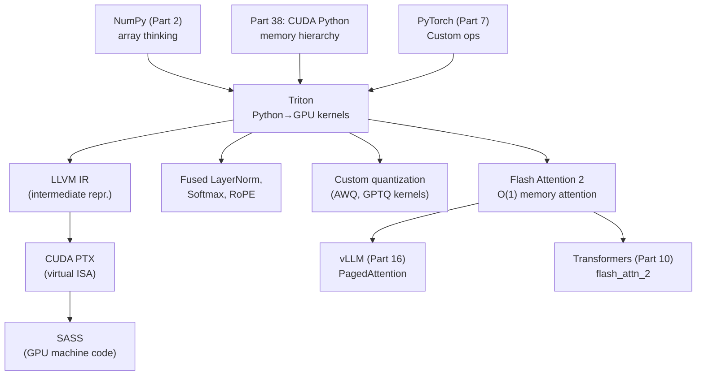
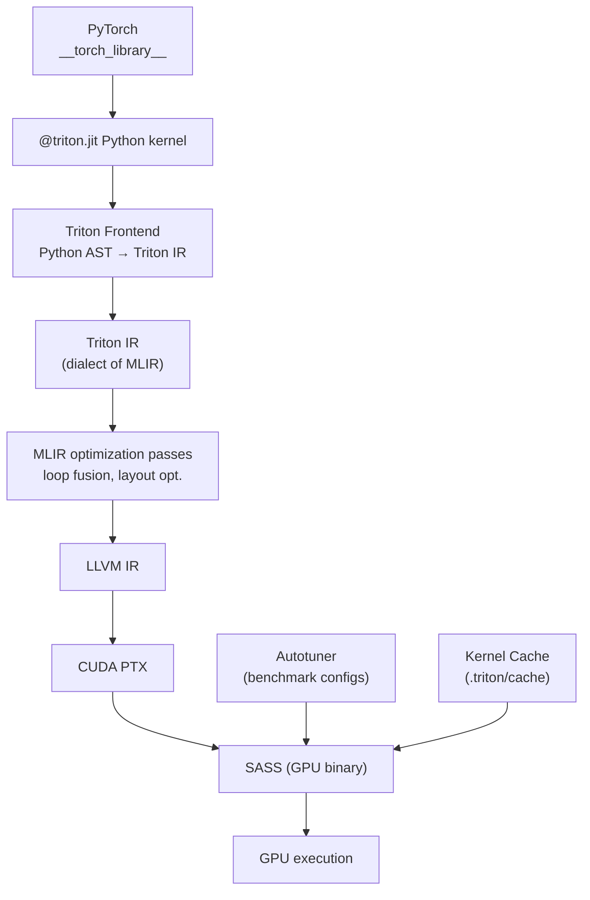

<!-- TEACHING_ORDER: verified -->
# Part 40: Triton — Python GPU Kernel Compiler

> **Prerequisites:** Part 38 (CUDA Python), Part 7 (PyTorch) | **Capstone Part** | **Version anchor:** triton 3.x (mid-2026)

---

## Why This Library Exists

Writing efficient GPU kernels has historically required C++ and deep CUDA expertise. Yet PyTorch's built-in ops don't always match the specific memory access patterns of new model architectures — Flash Attention, fused LayerNorm, custom quantization kernels, and novel attention variants all benefit from custom kernels. CUDA C++ kernel writing is a 1–2 week task per kernel for an experienced GPU engineer.

Triton was created by Philippe Tillet at OpenAI in 2019 to solve this: a **Python-based GPU kernel compiler** that lets ML engineers write high-performance CUDA kernels using familiar Python syntax with minimal CUDA expertise. Triton programs specify computation at the "tile" level (blocks of data), and the Triton compiler handles thread mapping, memory coalescing, shared memory management, and tensor core utilization automatically. Flash Attention 2, the most important custom kernel for LLM training, is implemented in Triton.

---

## Explain Like I Am 10

Writing a fast GPU program is like organizing a very large team of workers in a factory. In regular CUDA, you have to tell every single worker what to do (all 10,000 of them). In Triton, you just describe the job for one group of 64 workers, and Triton figures out how all the other groups should work in parallel — it's like having a manager who coordinates all the teams.

---

## Mental Model

Triton programs operate on **tiles** (blocks of a tensor, e.g., a 64×64 matrix block) rather than individual elements. The programmer writes the computation for one tile; Triton launches enough tiles to cover the full tensor. Within a tile, operations on blocks of elements use `tl.load`, `tl.store`, `tl.dot` — Triton maps these automatically to shared memory, memory-coalesced loads, and tensor core instructions.

```
Programmer writes:              Triton generates:
─────────────────               ───────────────────────
for tile in matrix:             Multiple thread blocks, each:
    a = tl.load(A_ptr)          Coalesced global memory load
    b = tl.load(B_ptr)          Coalesced global memory load
    c = tl.dot(a, b)        →   WMMA tensor core instruction
    tl.store(C_ptr, c)          Coalesced global memory store
                                + shared memory management (automatic)
```

---

## Learning Dependency Graph



---

## Core Concepts

### 1. The Triton Programming Model

Every Triton kernel is a function decorated with `@triton.jit`. It runs on a **grid** of program instances (equivalent to CUDA blocks). Each program instance has an `id` (the program ID in the grid) and operates on a **tile** of the input/output tensors.

```python
@triton.jit
def my_kernel(ptr, n, BLOCK_SIZE: tl.constexpr):
    pid    = tl.program_id(0)          # which tile am I?
    offsets = pid * BLOCK_SIZE + tl.arange(0, BLOCK_SIZE)  # my tile's indices
    mask   = offsets < n               # bounds check
    x      = tl.load(ptr + offsets, mask=mask)  # load my tile
    tl.store(ptr + offsets, x * 2, mask=mask)   # store result
```

Launch: `my_kernel[(n + BLOCK_SIZE - 1) // BLOCK_SIZE,](ptr, n, BLOCK_SIZE=1024)`

### 2. tl.load and tl.store

These are the primary memory access primitives. Triton automatically:
- Coalesces contiguous loads into wide memory transactions
- Manages L1 cache hints (eviction policy)
- Supports masked loads (out-of-bounds → 0.0 fill value)

```python
x = tl.load(ptr + offsets, mask=mask, other=0.0)  # safe, padded load
```

### 3. tl.dot — Tensor Core Matrix Multiply

The most important Triton primitive: `tl.dot(a, b)` computes a matrix multiply on tiles. Triton automatically maps this to Tensor Core WMMA instructions (FP16, BF16, FP8, INT8). Block sizes must be multiples of 16 for tensor core utilization.

```python
# 64×64 matrix tiles
acc = tl.zeros((BLOCK_M, BLOCK_N), dtype=tl.float32)
for k in range(K // BLOCK_K):
    a = tl.load(A_ptr + ...)   # [BLOCK_M, BLOCK_K]
    b = tl.load(B_ptr + ...)   # [BLOCK_K, BLOCK_N]
    acc += tl.dot(a, b)        # maps to tensor cores
```

### 4. tl.constexpr

Template parameters known at compile time. Triton generates specialized kernel code for each distinct value. This enables compile-time loop unrolling, block size specialization, and conditional kernel variants.

### 5. Autotuning

Triton has built-in autotuning: define a set of configuration candidates (block sizes, pipeline depth, etc.) and Triton benchmarks all candidates and selects the fastest for each hardware target.

### 6. Triton vs CUDA

| Aspect | Triton | CUDA C++ |
|--------|--------|----------|
| Shared memory | Automatic | Manual |
| Memory coalescing | Automatic | Manual |
| Thread indexing | Tile-level | Per-thread |
| Tensor cores | Automatic (tl.dot) | Manual (wmma) |
| Learning curve | 1–2 days | 2–4 weeks |
| Flexibility | High | Maximum |
| Performance | 80–95% of CUDA | 100% ceiling |

---

## Internal Architecture



Triton is built on MLIR (Multi-Level Intermediate Representation). The Triton IR is an MLIR dialect that expresses tile-level operations. MLIR passes handle layout optimization (choosing row vs column major storage for tiles), tensor core mapping, and pipeline depth. This compiler stack is what enables Triton to achieve near-CUDA performance without manual shared memory management.

---

## Essential APIs

```python
import triton
import triton.language as tl
import torch

# ── Basic elementwise kernel ─────────────────────────────────────────
@triton.jit
def relu_kernel(x_ptr, out_ptr, n, BLOCK_SIZE: tl.constexpr):
    pid     = tl.program_id(0)
    offsets = pid * BLOCK_SIZE + tl.arange(0, BLOCK_SIZE)
    mask    = offsets < n
    x       = tl.load(x_ptr + offsets, mask=mask)
    out     = tl.maximum(x, 0.0)  # vectorized ReLU on tile
    tl.store(out_ptr + offsets, out, mask=mask)

def relu(x: torch.Tensor) -> torch.Tensor:
    out    = torch.empty_like(x)
    n      = x.numel()
    BLOCK  = 1024
    grid   = (triton.cdiv(n, BLOCK),)  # number of program instances
    relu_kernel[grid](x, out, n, BLOCK_SIZE=BLOCK)
    return out

# ── Matrix multiplication with tensor cores ─────────────────────────
@triton.jit
def matmul_kernel(
    a_ptr, b_ptr, c_ptr,
    M, N, K,
    stride_am, stride_ak,
    stride_bk, stride_bn,
    stride_cm, stride_cn,
    BLOCK_M: tl.constexpr, BLOCK_N: tl.constexpr, BLOCK_K: tl.constexpr,
):
    pid_m = tl.program_id(0)
    pid_n = tl.program_id(1)

    offs_m = pid_m * BLOCK_M + tl.arange(0, BLOCK_M)
    offs_n = pid_n * BLOCK_N + tl.arange(0, BLOCK_N)
    offs_k = tl.arange(0, BLOCK_K)

    a_ptrs = a_ptr + offs_m[:, None] * stride_am + offs_k[None, :] * stride_ak
    b_ptrs = b_ptr + offs_k[:, None] * stride_bk + offs_n[None, :] * stride_bn

    acc = tl.zeros((BLOCK_M, BLOCK_N), dtype=tl.float32)
    for k in range(0, K, BLOCK_K):
        a = tl.load(a_ptrs, mask=(offs_m[:, None] < M) & ((offs_k + k)[None, :] < K))
        b = tl.load(b_ptrs, mask=((offs_k + k)[:, None] < K) & (offs_n[None, :] < N))
        acc += tl.dot(a, b)  # tensor cores!
        a_ptrs += BLOCK_K * stride_ak
        b_ptrs += BLOCK_K * stride_bk

    c_ptrs = c_ptr + offs_m[:, None] * stride_cm + offs_n[None, :] * stride_cn
    tl.store(c_ptrs, acc, mask=(offs_m[:, None] < M) & (offs_n[None, :] < N))

# ── Autotuning ───────────────────────────────────────────────────────
@triton.autotune(
    configs=[
        triton.Config({"BLOCK_M": 128, "BLOCK_N": 256, "BLOCK_K": 64}, num_stages=3, num_warps=8),
        triton.Config({"BLOCK_M": 64,  "BLOCK_N": 256, "BLOCK_K": 32}, num_stages=4, num_warps=4),
        triton.Config({"BLOCK_M": 128, "BLOCK_N": 128, "BLOCK_K": 32}, num_stages=4, num_warps=4),
    ],
    key=["M", "N", "K"],
)
@triton.jit
def fast_matmul_kernel(...): ...  # kernel body

# ── Softmax kernel ────────────────────────────────────────────────────
@triton.jit
def softmax_kernel(output_ptr, input_ptr, n_cols, BLOCK_SIZE: tl.constexpr):
    row   = tl.program_id(0)
    ptr   = input_ptr + row * n_cols
    offs  = tl.arange(0, BLOCK_SIZE)
    mask  = offs < n_cols
    x     = tl.load(ptr + offs, mask=mask, other=-float("inf"))
    x_max = tl.max(x, axis=0)               # online softmax max
    x     = tl.exp(x - x_max)
    x_sum = tl.sum(x, axis=0)
    y     = x / x_sum
    tl.store(output_ptr + row * n_cols + offs, y, mask=mask)
```

---

## API Learning Roadmap

**Beginner (week 1):**
- Write first elementwise kernel (ReLU, GELU, LayerNorm)
- Understand `tl.program_id()`, `tl.arange()`, `tl.load()`, `tl.store()`
- Compare correctness vs PyTorch reference implementation

**Intermediate (week 2–3):**
- Write fused softmax kernel with online max
- Write matrix multiply with `tl.dot()` and verify tensor core utilization
- Use `@triton.autotune` with multiple configs
- Profile with `triton.testing.do_bench()`

**Staff / Production (week 4+):**
- Flash Attention implementation (multi-tile KV iteration, online softmax)
- Fused quantization kernels (FP16→INT8/FP8)
- CUDA graph integration for repeated kernel sequences
- Multi-GPU kernels with tl.atomic operations

---

## Beginner Examples

```python
import triton
import triton.language as tl
import torch

@triton.jit
def add_kernel(x_ptr, y_ptr, out_ptr, n, BLOCK_SIZE: tl.constexpr):
    """Elementwise addition: out = x + y"""
    pid     = tl.program_id(0)
    offsets = pid * BLOCK_SIZE + tl.arange(0, BLOCK_SIZE)
    mask    = offsets < n
    x       = tl.load(x_ptr + offsets, mask=mask, other=0.0)
    y       = tl.load(y_ptr + offsets, mask=mask, other=0.0)
    tl.store(out_ptr + offsets, x + y, mask=mask)

def triton_add(x: torch.Tensor, y: torch.Tensor) -> torch.Tensor:
    assert x.device.type == "cuda" and x.is_contiguous()
    out  = torch.empty_like(x)
    n    = x.numel()
    grid = (triton.cdiv(n, 1024),)
    add_kernel[grid](x, y, out, n, BLOCK_SIZE=1024)
    return out

# Test
if torch.cuda.is_available():
    x = torch.randn(1_000_000, device="cuda")
    y = torch.randn(1_000_000, device="cuda")
    out_triton = triton_add(x, y)
    out_torch  = x + y
    print(f"Max diff: {(out_triton - out_torch).abs().max().item():.2e}")
    # Output: Max diff: 0.00e+00
```

---

## Intermediate Examples

```python
import triton
import triton.language as tl
import torch

@triton.jit
def fused_layernorm_kernel(
    x_ptr, w_ptr, b_ptr, out_ptr,
    mean_ptr, rstd_ptr,
    N, eps,
    BLOCK_SIZE: tl.constexpr,
):
    """Fused LayerNorm: compute mean, variance, normalize in one pass."""
    row  = tl.program_id(0)
    offs = tl.arange(0, BLOCK_SIZE)
    mask = offs < N
    x    = tl.load(x_ptr + row * N + offs, mask=mask, other=0.0).to(tl.float32)

    # Compute mean and variance in one pass
    mean = tl.sum(x, axis=0) / N
    var  = tl.sum((x - mean) * (x - mean), axis=0) / N
    rstd = 1.0 / tl.sqrt(var + eps)

    # Store stats
    tl.store(mean_ptr + row, mean)
    tl.store(rstd_ptr + row, rstd)

    # Normalize + affine transform
    w    = tl.load(w_ptr + offs, mask=mask, other=1.0)
    b    = tl.load(b_ptr + offs, mask=mask, other=0.0)
    norm = (x - mean) * rstd
    out  = norm * w + b
    tl.store(out_ptr + row * N + offs, out.to(tl.float16), mask=mask)


@triton.autotune(
    configs=[
        triton.Config({"BLOCK_SIZE": 1024}),
        triton.Config({"BLOCK_SIZE": 2048}),
        triton.Config({"BLOCK_SIZE": 4096}),
    ],
    key=["N"],
)
@triton.jit
def autotuned_softmax(output_ptr, input_ptr, n_cols, N: int, BLOCK_SIZE: tl.constexpr):
    """Autotuned row-wise softmax."""
    row   = tl.program_id(0)
    offs  = tl.arange(0, BLOCK_SIZE)
    mask  = offs < n_cols
    x     = tl.load(input_ptr + row * n_cols + offs, mask=mask, other=-float("inf"))
    x    -= tl.max(x, axis=0)
    exp_x = tl.exp(x)
    y     = exp_x / tl.sum(exp_x, axis=0)
    tl.store(output_ptr + row * n_cols + offs, y, mask=mask)
```

---

## Advanced Examples

```python
"""
Flash Attention forward pass in Triton (simplified, causal mask).
Full implementation: https://github.com/Dao-AILab/flash-attention
"""
import triton
import triton.language as tl

@triton.jit
def flash_attention_fwd(
    Q_ptr, K_ptr, V_ptr, Out_ptr, L_ptr,
    stride_qz, stride_qh, stride_qm, stride_qk,
    stride_kz, stride_kh, stride_kn, stride_kk,
    stride_vz, stride_vh, stride_vn, stride_vk,
    stride_oz, stride_oh, stride_om, stride_ok,
    Z, H, M, N_CTX, HEAD_DIM: tl.constexpr,
    BLOCK_M: tl.constexpr, BLOCK_N: tl.constexpr,
    causal: tl.constexpr,
    sm_scale: tl.constexpr,
):
    start_m = tl.program_id(0)
    off_hz  = tl.program_id(1)
    off_z   = off_hz // H
    off_h   = off_hz %  H
    q_offset = off_z.to(tl.int64) * stride_qz + off_h.to(tl.int64) * stride_qh
    k_offset = off_z.to(tl.int64) * stride_kz + off_h.to(tl.int64) * stride_kh
    v_offset = off_z.to(tl.int64) * stride_vz + off_h.to(tl.int64) * stride_vh
    o_offset = off_z.to(tl.int64) * stride_oz + off_h.to(tl.int64) * stride_oh

    Q_ptrs  = Q_ptr + q_offset + (start_m * BLOCK_M + tl.arange(0, BLOCK_M))[:, None] * stride_qm + tl.arange(0, HEAD_DIM)[None, :] * stride_qk
    K_ptrs  = K_ptr + k_offset + tl.arange(0, BLOCK_N)[:, None] * stride_kn + tl.arange(0, HEAD_DIM)[None, :] * stride_kk
    V_ptrs  = V_ptr + v_offset + tl.arange(0, BLOCK_N)[:, None] * stride_vn + tl.arange(0, HEAD_DIM)[None, :] * stride_vk
    Out_ptrs = Out_ptr + o_offset + (start_m * BLOCK_M + tl.arange(0, BLOCK_M))[:, None] * stride_om + tl.arange(0, HEAD_DIM)[None, :] * stride_ok

    # Online softmax state
    m_i  = tl.full([BLOCK_M], float("-inf"), dtype=tl.float32)
    l_i  = tl.zeros([BLOCK_M], dtype=tl.float32)
    acc  = tl.zeros([BLOCK_M, HEAD_DIM], dtype=tl.float32)

    qk_scale = sm_scale * 1.44269504  # 1/log(2) for exp2 trick

    q = tl.load(Q_ptrs)

    lo = 0
    hi = (start_m + 1) * BLOCK_M if causal else N_CTX
    for start_n in range(lo, hi, BLOCK_N):
        k = tl.load(K_ptrs)
        # QK^T
        qk = tl.zeros((BLOCK_M, BLOCK_N), dtype=tl.float32)
        qk += tl.dot(q, tl.trans(k)) * qk_scale

        # Causal mask
        if causal:
            offs_m = start_m * BLOCK_M + tl.arange(0, BLOCK_M)
            offs_n = start_n + tl.arange(0, BLOCK_N)
            qk = tl.where(offs_m[:, None] >= offs_n[None, :], qk, float("-inf"))

        # Online softmax update
        m_ij = tl.max(qk, axis=1)
        p    = tl.math.exp2(qk - m_ij[:, None])
        l_ij = tl.sum(p, axis=1)

        # Rescale acc
        alpha = tl.math.exp2(m_i - tl.maximum(m_i, m_ij))
        acc   = acc * alpha[:, None]
        acc  += tl.dot(p.to(tl.float16), tl.load(V_ptrs))
        m_i   = tl.maximum(m_i, m_ij)
        l_i   = l_i * alpha + l_ij

        K_ptrs += BLOCK_N * stride_kn
        V_ptrs += BLOCK_N * stride_vn

    acc /= l_i[:, None]
    tl.store(Out_ptrs, acc.to(tl.float16))
    tl.store(L_ptr + off_hz * M + start_m * BLOCK_M + tl.arange(0, BLOCK_M),
             m_i + tl.log2(l_i))
```

---

## Internal Interview Knowledge

**How does Triton map tl.dot to tensor cores?**
When `tl.dot(a, b)` is called with tile sizes that are multiples of 16 (required for tensor cores), Triton's MLIR backend lowers this to WMMA (Warp Matrix Multiply Accumulate) or WGMMA (Hopper's warp group MMA) instructions in PTX. The compiler selects the right instruction set based on the target GPU architecture (Volta: 16×16×16 FP16, Ampere: extended shapes, Hopper: WGMMA FP8/BF16).

**Why is Flash Attention implemented in Triton?**
Standard attention materializes the N×N attention matrix in global memory — O(N²) memory. Flash Attention tiles the attention computation: for each tile of Q, it iterates over tiles of K and V, accumulating the attention output incrementally using online softmax. The tile-level programming model maps exactly to Triton's paradigm. CUDA C++ would also work but requires 3–5× more code.

**What is the `num_stages` parameter in autotuning?**
Controls software pipelining depth in the kernel. Triton issues `num_stages` async loads ahead of computation, hiding memory latency. Higher `num_stages` = more registers consumed. Optimal: 2–4 stages on A100/H100; more registers on newer GPUs allow more stages.

**How does Triton handle shared memory?**
Triton manages shared memory automatically for `tl.dot` operands and software-pipelined loads — the programmer never explicitly allocates shared memory. The MLIR backend decides the optimal tile layout (row-major vs column-major) and padding to avoid bank conflicts. This is the primary developer experience advantage over CUDA.

**What are `tl.constexpr` variables?**
Template-like parameters known at kernel compile time. Triton generates a specialized kernel binary for each distinct combination of `constexpr` values. This enables compile-time loop unrolling, block size specialization, and conditional compilation (e.g., `if CAUSAL: ... else: ...` with zero runtime overhead).

---

## Production AI Usage

- **Flash Attention 2 (Tri Dao):** The most widely-used custom kernel in LLM training and inference, written entirely in Triton. Used by GPT-4, LLaMA, Mistral, and virtually every production LLM.
- **vLLM (Part 16):** PagedAttention attention kernels implemented in Triton for custom memory access patterns.
- **xFormers (Meta):** Custom efficient attention variants in Triton used in Llama 2 training.
- **PyTorch 2.0 `torch.compile`:** Uses Triton as the backend for generated GPU kernels from dynamo/inductor optimization passes.
- **Hugging Face Transformers:** `flash_attention_2` backend uses Triton via the flash-attn library.
- **OpenAI:** Triton was created at OpenAI and is used for custom training kernels internally.

---

## Common Mistakes

1. **Block sizes not multiples of 16** — `tl.dot` requires block dimensions that are multiples of 16 for tensor core utilization. Non-multiples fall back to slower CUDA cores.
2. **Forgetting masks on loads** — Out-of-bounds loads without `mask=mask` produce undefined behavior (NaN, garbage values). Always use `mask=offsets < n, other=0.0`.
3. **Wrong stride calculation** — Triton uses byte-level or element-level strides depending on the pointer type. Use `x.stride()` from PyTorch to pass correct strides.
4. **Using `float` instead of `tl.float32`** — Python `float` in a kernel uses host-side operations. Always use `tl.float32`, `tl.float16`, `tl.bfloat16` for GPU-side types.
5. **Not benchmarking against cuBLAS/cuDNN** — Triton's `tl.dot` competes with cuBLAS GEMM. For standard GEMM, cuBLAS is often still faster. Use Triton for fused ops where cuBLAS can't be used.
6. **Autotuning with too few configs** — Triton autotune benchmarks each config on first call. Too few configs = suboptimal performance. Too many = long first-call delay. Start with 4–8 configs.

---

## Performance Optimization

```python
import triton
import triton.language as tl

# 1. Software pipelining: prefetch next tile while computing current
@triton.jit
def pipelined_gemm(A, B, C, M, N, K, BLOCK_M: tl.constexpr, BLOCK_N: tl.constexpr, BLOCK_K: tl.constexpr):
    # Use num_stages=3 in @triton.autotune config to enable 3-stage pipeline
    ...

# 2. Tensor core alignment: ensure BLOCK_M, BLOCK_N multiples of 16
# Good:  BLOCK_M=128, BLOCK_N=256, BLOCK_K=64
# Bad:   BLOCK_M=100 (not multiple of 16)

# 3. Use tl.dot accumulator in float32, store in float16
acc = tl.zeros((BLOCK_M, BLOCK_N), dtype=tl.float32)  # accumulate in fp32
acc += tl.dot(a, b)
tl.store(c_ptr, acc.to(tl.float16), ...)  # store in fp16

# 4. Benchmark kernels properly
from triton.testing import do_bench

ms = do_bench(lambda: my_triton_kernel[grid](x, y, out, n, BLOCK_SIZE=1024))
print(f"Kernel latency: {ms:.3f} ms")
print(f"Bandwidth: {x.nbytes * 3 / ms * 1e-9:.1f} GB/s")

# 5. Inspect generated PTX for debugging
import triton.tools.inspect as tinspect
ir = tinspect.get_ttir(my_kernel, ...)  # get Triton IR
ptx = tinspect.get_ptx(my_kernel, ...) # get PTX

# 6. Use FP8 for maximum tensor core throughput (H100+)
@triton.jit
def fp8_gemm(A, B, C, ...):
    a = tl.load(A + ...).to(tl.float8e4m3fnuz)
    b = tl.load(B + ...).to(tl.float8e4m3fnuz)
    acc = tl.dot(a, b, out_dtype=tl.float32)  # FP8 tensor cores
    tl.store(C + ..., acc.to(tl.bfloat16))
```

---

## Production Failures

**Failure: Kernel produces NaN on some inputs but not others**
Cause: Online softmax with `-inf` masking; `exp(-inf) = 0` but `0/0 = NaN` when all values are `-inf`.
Fix: Add `tl.where(l_i > 0, acc / l_i, tl.zeros_like(acc))` to handle all-masked rows.

**Failure: First call to autotuned kernel is 30 seconds**
Cause: Autotuning benchmarks all configs, each requiring a JIT compilation.
Fix: Use `triton.Config(..., pre_hook=lambda: ...)` to limit autotune search space. Use `TRITON_CACHE_DIR` to persist compiled kernels across runs.

**Failure: tl.dot outputs wrong results with large tile sizes**
Cause: Tensor core accumulation overflow in FP16 accumulator.
Fix: Always accumulate in `tl.float32`: `acc = tl.zeros(..., dtype=tl.float32)`.

**Failure: Kernel is slower than expected despite tensor core utilization**
Cause: Register spilling due to large tile sizes consuming too many registers.
Fix: Reduce BLOCK_M or BLOCK_N; use `@triton.autotune` to find the optimal tile size.

---

## Best Practices

- Always compare output against PyTorch reference with `torch.testing.assert_close()` before benchmarking performance.
- Use `@triton.autotune` with 4–8 configs covering block sizes from 64 to 256 — optimal config varies per GPU architecture.
- Accumulate in FP32, store in FP16/BF16 — never lose precision in the accumulator.
- Profile with `triton.testing.do_bench()` rather than Python `time.perf_counter()` — measures stable GPU time.
- Write the simplest correct kernel first, then add optimizations (software pipelining, tensor core alignment) incrementally.
- Check PTX/TTIR for debug: `triton.tools.inspect.get_ptx()` reveals if tensor cores are actually being used.

---

## Library Relationships

| Aspect | Triton | CUDA C++ | CuPy | Numba |
|--------|--------|----------|------|-------|
| Abstraction level | Tile-level | Thread-level | Array-level | Thread-level (Python) |
| Tensor cores | Automatic | Manual WMMA | Via cuBLAS | Limited |
| Shared memory | Automatic | Manual | N/A | Manual |
| Learning curve | 1–2 days | 2–4 weeks | Hours | Days |
| Custom kernels | Full support | Full support | No | Moderate |
| Production use | Flash Attention | cuDNN, TensorRT | Data processing | Prototyping |
| PyTorch integration | First-class | Extensions | CuPy bridge | Limited |

---

## Role-Based Usage

| Role | Primary Use |
|------|-------------|
| LLM Engineer | Flash Attention variants, custom attention masks, fused positional encoding |
| ML Engineer | Fused activations (GELU, SiLU + norm), custom quantization (AWQ, GPTQ) |
| Research | Prototype novel architecture primitives before production |
| Systems Engineer | Optimize critical inference kernels for latency (fused softmax, layer norm) |
| MLOps | `torch.compile` with Triton backend for automatic kernel fusion |

---

## Cheat Sheet

```python
import triton
import triton.language as tl
import torch

# Kernel template
@triton.jit
def my_kernel(x_ptr, out_ptr, n, BLOCK: tl.constexpr):
    pid     = tl.program_id(0)
    offsets = pid * BLOCK + tl.arange(0, BLOCK)
    mask    = offsets < n
    x       = tl.load(x_ptr + offsets, mask=mask, other=0.0)
    result  = tl.exp(x)                     # elementwise
    tl.store(out_ptr + offsets, result, mask=mask)

# 2D tile indexing
pid_m   = tl.program_id(0); pid_n = tl.program_id(1)
offs_m  = pid_m * BLOCK_M + tl.arange(0, BLOCK_M)  # [BLOCK_M]
offs_n  = pid_n * BLOCK_N + tl.arange(0, BLOCK_N)  # [BLOCK_N]
ptrs    = base + offs_m[:, None] * stride_m + offs_n[None, :] * stride_n  # [BM, BN]

# Matrix multiply tile
acc = tl.zeros((BLOCK_M, BLOCK_N), dtype=tl.float32)
a   = tl.load(A_ptrs)  # [BLOCK_M, BLOCK_K]
b   = tl.load(B_ptrs)  # [BLOCK_K, BLOCK_N]
acc += tl.dot(a, b)    # tensor cores!

# Launch
grid = (triton.cdiv(M, BLOCK_M), triton.cdiv(N, BLOCK_N))
my_kernel[grid](x, out, n, BLOCK=1024)

# Benchmark
ms = triton.testing.do_bench(lambda: my_kernel[grid](...))

# Autotune
@triton.autotune(
    configs=[triton.Config({"BLOCK_SIZE": 1024}, num_warps=4), ...],
    key=["N"],
)
@triton.jit
def autotuned_kernel(...): ...
```

---

## Flash Cards

- **Q: What does `tl.program_id(0)` return?** A: The index of the current program instance in dimension 0 of the launch grid — equivalent to `blockIdx.x` in CUDA.
- **Q: What does `tl.dot(a, b)` map to on GPU?** A: Tensor Core WMMA/WGMMA instructions when tile sizes are multiples of 16. The most important Triton primitive for performance.
- **Q: Why use `tl.constexpr` for block sizes?** A: Enables compile-time specialization — Triton generates a different kernel binary for each block size, enabling loop unrolling and compile-time conditionals with zero runtime overhead.
- **Q: What makes Flash Attention O(1) memory?** A: It never materializes the full N×N attention matrix. Instead, it tiles over K and V, accumulating the output incrementally with online softmax. Memory = O(N × d) instead of O(N²).
- **Q: How does `@triton.autotune` work?** A: On the first call, it benchmarks all provided config candidates by running the kernel with each configuration. It selects the fastest config for the given problem shape and caches it for subsequent calls.

---

## Revision Notes

- Triton = Python GPU kernel compiler at tile level (not thread level like CUDA)
- Core ops: `tl.load()`, `tl.store()`, `tl.dot()`, `tl.arange()`, `tl.program_id()`
- `tl.dot()` → automatic tensor core utilization (block sizes must be multiples of 16)
- Shared memory managed automatically (unlike CUDA C++)
- `@triton.autotune` for config selection per hardware
- `tl.constexpr` for compile-time specialization
- Flash Attention 2 = the canonical Triton success story: O(N²)→O(1) memory attention
- `torch.compile` uses Triton as its codegen backend for kernel fusion
- Production use: Flash Attention, vLLM kernels, xFormers, quantization kernels

---

## Interview Question Bank

### Top 25 Beginner

**Q1: What is Triton and who created it?**
A: Triton is an open-source GPU kernel compiler that allows writing high-performance CUDA kernels in Python. It was created by Philippe Tillet at OpenAI in 2019 and is now the primary kernel writing tool for ML engineers at OpenAI and across the industry.

**Q2: How does Triton differ from CuPy?**
A: CuPy provides NumPy-compatible GPU array operations using pre-compiled libraries (cuBLAS, cuFFT). Triton lets you write *custom* GPU kernels from scratch in Python. Use CuPy for standard ops; use Triton when you need custom memory access patterns or fused operations.

**Q3: What is `tl.program_id()`?**
A: Returns the index of the current kernel instance in the specified dimension of the launch grid. Used to compute which tile of data the current kernel instance should process.

**Q4: What is a Triton "tile"?**
A: A contiguous block of tensor elements that one kernel instance (one "program") processes. Triton programs operate on tiles rather than individual elements, enabling automatic vectorization and memory access optimization.

**Q5: How do you launch a Triton kernel?**
A: `my_kernel[grid](args...)` where `grid` is a tuple specifying the number of program instances to launch. For elementwise ops: `grid = (triton.cdiv(n, BLOCK_SIZE),)`.

**Q6: What is `tl.load()` and why does it need a mask?**
A: `tl.load(ptr + offsets, mask=mask)` loads a tile of data from GPU memory. The mask prevents out-of-bounds reads when the data size isn't a multiple of the block size. `other=0.0` specifies what to fill for masked (out-of-bounds) positions.

**Q7: What does `tl.dot(a, b)` compute?**
A: A matrix multiply of two 2D tiles `a` and `b`. Triton automatically maps this to tensor core WMMA instructions when tile dimensions are multiples of 16, achieving peak GPU throughput.

**Q8: What is Flash Attention?**
A: A custom attention algorithm that computes attention in tiles over K and V, using online softmax to accumulate the output without materializing the full N×N attention matrix. Memory complexity: O(N) instead of O(N²). Implemented in Triton by Tri Dao.

**Q9: What is `tl.constexpr`?**
A: A kernel parameter known at compile time. Triton generates a specialized kernel binary for each distinct value. Used for block sizes, boolean flags, and any parameter that should be a compile-time constant for optimization.

**Q10: How does Triton manage shared memory?**
A: Automatically. The programmer never explicitly allocates or manages shared memory — Triton's MLIR compiler decides which data to cache in shared memory and handles padding to avoid bank conflicts.

**Q11: What is `@triton.autotune`?**
A: A decorator that benchmarks multiple kernel configurations (block sizes, pipeline depth) on first call and selects the fastest for the given problem shape and GPU architecture.

**Q12: How does Triton relate to PyTorch `torch.compile`?**
A: PyTorch's dynamo/inductor compilation stack uses Triton as its codegen backend. When you call `torch.compile(model)`, PyTorch traces operations and generates Triton kernels for fused operation sequences.

**Q13: What is the difference between `tl.float32` and Python `float` in a kernel?**
A: `tl.float32` is a GPU-side type for computations within a Triton kernel. Python `float` is a host-side 64-bit float — using it inside a kernel may cause host-side execution or unexpected behavior. Always use `tl.float32`, `tl.float16`, `tl.bfloat16`.

**Q14: What is `triton.cdiv()`?**
A: Ceiling division: `(a + b - 1) // b`. Used to compute the number of tiles needed to cover a dimension: `grid = (triton.cdiv(n, BLOCK_SIZE),)`.

**Q15: Why do Triton kernel block sizes need to be multiples of 16?**
A: For `tl.dot` to use tensor cores, block dimensions must be multiples of 16 (matching WMMA tile shape requirements). Non-multiples fall back to regular CUDA cores, losing 8–16× throughput.

**Q16: What is online softmax?**
A: An algorithm that computes softmax incrementally, processing one tile at a time, without needing to know all values in advance. Maintains running maximum (m) and sum (l); each new tile updates m and l. Used in Flash Attention to avoid materializing full attention scores.

**Q17: How do you benchmark a Triton kernel accurately?**
A: Use `triton.testing.do_bench(lambda: my_kernel[grid](...))`. This handles GPU warm-up, runs multiple iterations, and returns stable median latency. Don't use Python `time.perf_counter()` — it includes Python overhead and async GPU execution.

**Q18: What is `tl.arange(0, BLOCK_SIZE)`?**
A: Creates a 1D tensor of integers [0, 1, 2, ..., BLOCK_SIZE-1]. Used as offsets from the tile start position to index each element in the tile.

**Q19: How is a 2D tile addressed in Triton?**
A: Using broadcasting: `offs_m[:, None] * stride_m + offs_n[None, :] * stride_n` creates a [BLOCK_M, BLOCK_N] matrix of pointer offsets. Each element [i, j] addresses position (i, j) in the 2D tensor.

**Q20: What frameworks use Triton in production?**
A: PyTorch (`torch.compile`), Flash Attention (all LLM training), vLLM (PagedAttention kernels), xFormers (efficient attention), Unsloth (optimized LLM fine-tuning), TGI (Hugging Face inference).

**Q21: What is `num_warps` in Triton?**
A: The number of GPU warps (groups of 32 threads) assigned to each program instance. Higher `num_warps` = more parallelism within a tile. Typical values: 4–8. Must be power of 2.

**Q22: How do you inspect the generated PTX from a Triton kernel?**
A: `triton.tools.inspect.get_ptx(my_kernel, signature, constants)` returns the PTX assembly. Check for `wmma` or `mma.` instructions to verify tensor core usage.

**Q23: What is `tl.maximum(a, b)` in Triton?**
A: Elementwise maximum of two tensors (like `np.maximum`). Used in online softmax to update the running maximum.

**Q24: How does Triton handle different GPU architectures?**
A: Triton's MLIR backend has architecture-specific lowering passes. A kernel with `tl.dot` generates WMMA instructions for Ampere, WGMMA for Hopper, Tensor Core operations for Ada. The same Triton code produces optimized code across architectures.

**Q25: What is the Triton kernel cache?**
A: Compiled kernel binaries are cached in `~/.triton/cache/` (configurable via `TRITON_CACHE_DIR`). On subsequent runs, compiled kernels are loaded from cache, eliminating recompilation overhead.

---

### Top 25 Intermediate

**Q1: Explain how online softmax enables Flash Attention's O(N) memory.**
A: Standard attention: compute QKᵀ → N×N matrix → softmax → multiply V. Requires storing N²×d floats. Flash Attention: for each Q tile, iterate over K,V tiles. Maintain running max `m` and sum `l`. For each K tile: (1) compute partial scores, (2) update `m_new = max(m, new_max)`, (3) rescale previous accumulator by `exp(m - m_new)`, (4) add new contribution. Never materialize full N×N matrix — only tile-sized intermediates.

**Q2: How does Triton handle the reduction operations like `tl.sum()` and `tl.max()`?**
A: Reductions within a tile use warp-level primitives. `tl.sum(x, axis=0)` reduces across the BLOCK_SIZE dimension using warp shuffles and shared memory reduction tree. The compiler generates efficient CUDA reduction code automatically.

**Q3: What is software pipelining in Triton and how is it configured?**
A: Software pipelining issues async memory loads for the next tile while computing the current tile. Controlled by `num_stages` in `triton.Config`: 2 stages = one lookahead, 3 stages = two lookaheads. Each stage requires additional registers to hold prefetched data. Optimal: 2–4 stages on A100.

**Q4: How would you write a fused matrix multiply + ReLU in Triton?**
A: Extend the matmul kernel: after computing `acc = tl.dot(a, b)` in the k-loop, apply `out = tl.maximum(acc, 0.0)` before `tl.store()`. This eliminates a separate ReLU kernel launch, reducing memory bandwidth by ~2× (no intermediate write + read of the matmul output).

**Q5: How does Triton autotune know the optimal config for a problem?**
A: On first call with a new problem shape (as defined by `key=["M", "N", "K"]`), Triton runs all configs and measures latency with `do_bench`. The best config is stored in a cache file keyed by (kernel_hash, problem_size, GPU_type). Subsequent calls with the same key use the cached config.

**Q6: What is Triton's layout optimization in MLIR?**
A: Triton IR represents tiles abstractly; the MLIR layout pass decides how tiles are physically laid out in registers and shared memory (row-major, column-major, swizzled). For matmul: A tiles use column-major (efficient for row access of transposed K), B tiles use row-major. Swizzled layout avoids bank conflicts for large tile sizes.

**Q7: How do you implement a fused LayerNorm backward in Triton?**
A: LayerNorm backward needs: (1) recompute normalized values (or load from forward cache), (2) compute dγ = sum(dy * x_norm, dim=0), (3) compute dβ = sum(dy, dim=0), (4) compute dx = (dy - mean(dy * x_norm) * x_norm - mean(dy)) * rstd. All in one kernel pass per row. Triton's tiling handles the per-row computation efficiently.

**Q8: What is the attention `sm_scale` parameter?**
A: The attention scaling factor `1/sqrt(head_dim)` applied to QKᵀ before softmax. Prevents dot products from growing large as `head_dim` increases, which would push softmax into its saturation region. In Triton Flash Attention, multiplied by `1.44269504` (1/log(2)) to enable `tl.math.exp2` instead of `tl.exp` (faster).

**Q9: How would you implement grouped-query attention (GQA) in Triton?**
A: In standard MHA, each Q head attends to its own K,V head. In GQA, G query heads share one K,V head. In Triton: index K,V by `off_h // G` instead of `off_h`. This reduces K,V memory bandwidth by G× without changing Q computation.

**Q10: How does `triton.testing.assert_close()` help kernel development?**
A: `torch.testing.assert_close(triton_output, torch_reference, rtol=1e-2, atol=1e-3)` checks numerical correctness of the custom kernel against PyTorch's reference. Use relative tolerance (rtol) for FP16 (where values differ by ~0.1%) and absolute tolerance (atol) for near-zero values.

**Q11: What is the `BLOCK_K` dimension in matmul and why does it matter?**
A: BLOCK_K is the tile size along the reduction dimension K. Larger BLOCK_K = more arithmetic per tile load = higher arithmetic intensity. But larger BLOCK_K requires more registers (to hold two BLOCK_M×BLOCK_K and BLOCK_K×BLOCK_N tiles). Optimal BLOCK_K = 32–64 on A100.

**Q12: How do you implement causal masking efficiently in Triton?**
A: `qk = tl.where(offs_m[:, None] >= offs_n[None, :], qk, float("-inf"))`. For upper-left tiles (completely below diagonal), skip the masking: use `if start_n + BLOCK_N <= start_m * BLOCK_M` to enter a mask-free code path. Flash Attention uses this to avoid the mask overhead for fully-causal tiles.

**Q13: How does Triton handle FP8 on Hopper (H100)?**
A: Triton 3.0+ supports `tl.float8e4m3fnuz` and `tl.float8e5m2fnuz`. `tl.dot(a, b, out_dtype=tl.float32)` with FP8 inputs maps to WGMMA FP8 tensor core instructions on H100, achieving 3.9 PFLOPS theoretical throughput — 2× vs FP16.

**Q14: What is `tl.atomic_add()` used for in Triton?**
A: Atomic read-modify-write to global memory, safe for concurrent writes from multiple program instances. Used for gradient accumulation in distributed training or histogram computation. Note: atomics serialize concurrent writes — use reductions when possible.

**Q15: How would you implement a KV cache update kernel for inference?**
A: Input: new K, new V (single token), sequence position. Kernel: write new K,V to the correct position in the KV cache buffer. With PagedAttention: use block table to find the physical block, write within the block. Triton kernel: `tl.store(k_cache + block_start + seq_offset, new_k)`. Single program per head and layer for parallelism.

**Q16: How does Triton ensure numerical stability in softmax?**
A: Two-pass stable softmax: (1) max subtraction: `x -= tl.max(x, axis=0)`, (2) then `exp(x) / sum(exp(x))`. This prevents overflow from large dot product values. In Flash Attention, online softmax achieves this in one pass by maintaining running max `m_i` and rescaling previous accumulator when `m_i` increases.

**Q17: What is `tl.load` eviction policy and when would you change it?**
A: `eviction_policy="evict_last"` (default) keeps loaded data in L1 cache as long as possible. `evict_first` evicts early — useful for streaming data accessed only once (e.g., K and V in attention where each tile is used once). Improves cache efficiency for other data (Q) that's reused.

**Q18: How do you debug a Triton kernel that produces correct results on CPU simulation but wrong on GPU?**
A: (1) Reduce to minimum failing case (small M, N, K). (2) Print intermediate values with `tl.debug_barrier()` + device-side print (expensive but works). (3) Check numerical precision: FP16 has ~3 decimal places; use FP32 accumulator. (4) Verify strides: print `x.stride()` before kernel launch. (5) Use `TRITON_INTERPRET=1` for Python-side kernel simulation.

**Q19: What is `TRITON_INTERPRET=1` and when would you use it?**
A: An environment variable that runs Triton kernels in Python interpretation mode (no actual GPU compilation). Enables using Python debuggers (pdb) inside kernel code. Use only for debugging — 100–1000× slower than GPU execution.

**Q20: How do you implement reductions across program instances in Triton?**
A: Intra-tile reduction: `tl.sum(x, axis=0)` — fast, hardware warp-level. Inter-tile reduction: multiple passes — first pass writes partial reductions to global memory, second pass reduces them. Or use `tl.atomic_add` for commutative ops. For gradient accumulation in DDP, use NCCL AllReduce after Triton kernel.

**Q21: How would you implement rotary position embeddings (RoPE) as a fused Triton kernel?**
A: Fuse RoPE with Q,K projection: after loading Q/K tiles, apply sin/cos rotation in-register before storing. This eliminates a separate RoPE application kernel (saves one read + write of Q and K tensors). Triton handles the sin/cos table loading via `tl.load` with positional offsets.

**Q22: What is the memory consumption of a Triton softmax kernel vs standard PyTorch?**
A: PyTorch softmax: read input (N bytes), write intermediate exp output (N bytes), read again for division, write output (N bytes) = 4N bytes memory traffic. Triton fused softmax: read input once, compute exp, sum in-register, divide, write output once = 2N bytes. 2× memory bandwidth reduction.

**Q23: How would you implement multi-head attention as a single Triton kernel?**
A: Grid shape: `(batch * n_heads, seq_len_tiles)`. Each program instance handles one head for one Q tile. Outer loop iterates over K,V tiles. Use `off_hz = tl.program_id(1)` to select head; `off_z = off_hz // H` for batch, `off_h = off_hz % H` for head dimension. This parallelizes across all heads simultaneously.

**Q24: How does Triton's `tl.constexpr` enable conditional kernel variants?**
A: `if CAUSAL: ... else: ...` where `CAUSAL: tl.constexpr` allows the compiler to generate different kernel binaries for causal vs non-causal attention. The runtime branch is eliminated — one kernel binary has the mask logic, another doesn't. Same Python source, two specialized GPU executables.

**Q25: What is the relationship between Triton and torch.compile's Inductor backend?**
A: Inductor (PyTorch's compilation backend) lowers FX graph operations to Triton kernels via `triton.jit`. Operations like elementwise fusions, reduction fusions, and certain GEMM patterns are codegen'd as Triton kernels. Inductor handles operator fusion decisions; Triton handles the GPU kernel code generation and optimization.

---

### Top 25 Advanced

**Q1: Describe the complete compilation pipeline from Triton Python to GPU binary.**
A: (1) Python AST → Triton IR (custom MLIR dialect): models tile-level operations. (2) Triton IR → canonical MLIR: layout optimization (choose row/col-major, apply swizzling), vectorization. (3) MLIR → LLVM IR: lower to LLVM dialect. (4) LLVM IR → PTX: LLVM NVIDIA backend generates PTX. (5) PTX → SASS: NVIDIA's ptxas compiles to GPU machine code for the target architecture (sm_80, sm_90, etc.). (6) SASS cached in `~/.triton/cache/` keyed by kernel hash + GPU arch.

**Q2: How would you implement custom FP8 E4M3 quantized attention in Triton?**
A: Per-block quantized attention: (1) Load Q, K, V in FP16. (2) Per-BLOCK_N scale computation: `scale_k = tl.max(abs(k)) / 448.0` (E4M3 max). (3) Quantize: `k_fp8 = k / scale_k → to(tl.float8e4m3fnuz)`. (4) `tl.dot(q, k_fp8.T, out_dtype=tl.float32) * scale_k * scale_q`. (5) Softmax in FP32. (6) Output in BF16. Scale factors computed per tile to maximize utilization of FP8 range.

**Q3: How does Flash Attention 2's backward pass work in Triton?**
A: FlashAttn2 backward needs: (1) Recompute attention scores from Q, K (recomputation avoids storing N²×d attn weights). (2) From recomputed P, compute dV = Pᵀ dO. (3) dP = dO Vᵀ. (4) dS = P ⊙ (dP - sum(dP * P, dim=-1)[:, None]). (5) dQ = dS K; dK = dSᵀ Q. All in tiled Triton kernels with online recomputation — eliminates intermediate activation storage.

**Q4: How do you implement ring attention in Triton for sequence parallelism?**
A: Each device holds Q_i (its sequence shard) and starts with K_0, V_0 from GPU 0. (1) Compute local attention output from Q_i × K_0, V_0. (2) NCCL ring-send K_j, V_j to next device while receiving K_{j-1}, V_{j-1}. (3) Update attention output with online softmax update rule for new K,V pair. After N rounds, each device has complete attention output for its Q shard. Triton kernel handles the tile computation; NCCL handles ring communication.

**Q5: What are the performance implications of different tile sizes for different problem shapes?**
A: Matrix shape M×N×K: (1) Small M, large N: increase BLOCK_N, reduce BLOCK_M. (2) Batch small matrices: use grid (batch, M/BM, N/BN) not (M*batch/BM, N/BN). (3) Memory-bound (small K): maximize BLOCK_M, BLOCK_N for output reuse. (4) Compute-bound (large K): maximize BLOCK_K for arithmetic intensity. Autotune across configs to find optimal automatically.

**Q6: How would you design a Triton kernel for custom sparse attention patterns?**
A: Define a block-sparse attention mask (BLOCK_M × BLOCK_N block is 0 or 1). Before the K,V loop, load the block mask: `if not block_mask: continue`. Only compute attention for non-zero blocks. Triton grid: launch one program per non-zero block. This achieves O(nnz) computation for sparse attention (e.g., local window + cross-attention patterns in Longformer).

**Q7: How does Triton's data flow analysis affect kernel performance?**
A: Triton's compiler analyzes how data flows between operations and decides: (1) Which tiles to keep in registers between loads, (2) Whether to use shared memory staging (necessary for `tl.dot` operands). Poor data flow (writing intermediate tiles to global memory unnecessarily) is the main performance bug. Use `tl.fp_to_int` and similar without intermediate global stores.

**Q8: How would you implement a memory-efficient fused cross-entropy loss in Triton?**
A: Standard cross-entropy: compute logits (large N×V tensor, V=vocab_size) → store all → compute loss. Fused: tile over vocabulary V (BLOCK_V at a time). For each tile: (1) load logits, (2) track running max for numerical stability, (3) accumulate `sum(exp(logit))` incrementally. Only access each logit once — no materialization of full N×V softmax. 2× bandwidth savings vs standard.

**Q9: How do you implement Paged Attention in Triton (vLLM's kernel)?**
A: Attention with non-contiguous KV cache. K, V are stored in variable-size pages; a block table maps (sequence_id, block_idx) → physical_block_id. In Triton: (1) load block_table for current sequence, (2) for each KV block: dereference physical address = `kv_cache + physical_block * block_size`, (3) `tl.load` with these computed addresses, (4) compute attention as usual. The scatter/gather addressing is the key difference from standard attention.

**Q10: Describe how to write a Triton kernel that dynamically selects between different computation paths.**
A: Use `tl.constexpr` for known-at-compile-time decisions (causal vs non-causal, data type). Use runtime conditionals for data-dependent decisions (sequence lengths, batch sizes). Runtime conditionals in Triton are straightforward Python if/else — compiled to CUDA conditional branches. Minimize divergent branches by structuring so full warps take the same path (guard by program_id range, not threadIdx).

**Q11: How does Triton's MLIR layout optimization choose between row-major and column-major tile storage?**
A: The layout optimization pass in Triton's MLIR analyzes how each tile is accessed: if a tile is loaded from a row-major matrix and immediately transposed for `tl.dot`, the optimizer can instead load it in column-major order, eliminating the transpose. This pass also applies swizzling patterns to avoid shared memory bank conflicts without programmer intervention.

**Q12: How would you build a Triton kernel for custom Mixture-of-Experts routing?**
A: Expert computation is a gather-compute-scatter: (1) Router assigns tokens to experts (output: expert_ids, capacities). (2) Group tokens by expert — use `tl.sort` or `tl.gather`. (3) For each expert: `tl.load` its weight matrix, compute `tl.dot(tokens, W_expert)`. (4) Scatter outputs back to original token positions. The grouping step is the key custom operation; standard `tl.dot` handles the expert FFN.

**Q13: What are the limits of Triton compared to CUDA C++?**
A: (1) No support for dynamic shared memory allocation per kernel (fixed at compile time). (2) Limited support for atomic operations on non-standard types. (3) Cannot mix Triton and CUDA C++ code in the same kernel. (4) PTX/SASS-level optimizations (warp specialization, cluster launch for Hopper) not fully exposed. (5) Debugging is harder — no CUDA-GDB equivalent for Triton. For maximum performance kernels (e.g., cuBLAS-quality GEMM), CUDA C++ with hand-tuned assembly may still outperform Triton.

**Q14: How would you implement a Triton kernel for speculative decoding draft model scoring?**
A: Given a sequence of K draft tokens, compute: (1) standard attention for all K positions in parallel, (2) compute draft vs target distribution divergence per token. Triton kernel: run attention over [seq_len + K] with causal mask (K draft tokens can attend to history), tile over batch and heads. The parallelism over draft tokens is naturally handled by Triton's grid.

**Q15: How does Triton interact with CUDA Graphs for production inference?**
A: Triton kernels can be captured in CUDA Graphs: `with torch.cuda.graph(g): output = triton_attention(q, k, v)`. The graph records the kernel launch parameters. On replay: `g.replay()`. Works when input tensor shapes are fixed (typical for inference with padded batches). Combining with Triton eliminates both Python overhead and kernel launch overhead.

**Q16: Explain the triton.ops.attention implementation strategy for MQA (Multi-Query Attention).**
A: In MQA, all query heads share one KV head. Triton implementation: grid shape (batch, n_heads * seq_tiles). Head offset: `off_kv_head = 0` (only one KV head per batch). Q pointer increments by `stride_qh` per head; K,V pointers use `stride_kh = 0` (reuse same KV head). This change from MHA to MQA is just a stride modification — same kernel structure.

**Q17: How do you validate a Triton kernel's performance against the theoretical roofline?**
A: Compute kernel's FLOP count and memory traffic. `intensity = FLOPs / memory_bytes`. If intensity < ridge_point (=peak_FLOPS/peak_bandwidth): bandwidth-bound. If intensity > ridge_point: compute-bound. Measure actual GFLOPS: `FLOPs / (ms * 1e-3) / 1e12`. If actual << min(peak_FLOPS, intensity × bandwidth): optimization opportunity. For matmul with M=N=K=4096: 2×4096³ FLOPs, ~134M; A100 peak = 312 TFLOPS FP16.

**Q18: How would you implement warp specialization in Triton for persistent kernels?**
A: Warp specialization (Hopper feature): some warps compute, others do memory copies (producers/consumers). In Triton 3.0+: `warp_specialize=True` in `triton.Config` enables Hopper's TMA (Tensor Memory Accelerator) for async copies in dedicated "copy warps." This hides memory latency more aggressively than software pipelining.

**Q19: Describe the implementation of an INT8 GEMM kernel in Triton.**
A: (1) Quantize inputs to INT8 with per-tensor or per-channel scales. (2) Load INT8 tiles: `a = tl.load(...).to(tl.int8)`. (3) `tl.dot(a, b, out_dtype=tl.int32)` — uses INT8 tensor cores, accumulates in INT32. (4) Dequantize: `out = acc.to(tl.float32) * scale_a * scale_b`. (5) Store in FP16/BF16. INT8 tensor cores: 2× throughput vs FP16 on Ampere, critical for inference optimization.

**Q20: How do you handle variable sequence lengths in a Triton attention kernel?**
A: Two approaches: (1) Padding: pad all sequences to max_seq_len, use masks. Simple but wastes compute for short sequences. (2) Variable-length (flash_attn varlen API): pass sequence start offsets `cu_seqlens_q`, `cu_seqlens_k`. Each program instance bounds its K,V iteration to `[cu_seqlens_k[batch], cu_seqlens_k[batch+1]]`. No padding needed but requires sorting by sequence length for efficiency.

**Q21: How does Triton's `do_bench` compute accurate latency?**
A: (1) Warm-up runs to trigger JIT compilation and fill caches. (2) Time a large number of iterations (default 100). (3) Return median time after discarding outliers. (4) Uses CUDA events for GPU-side timing (not CPU time). This approach eliminates JIT overhead, cold-start effects, and CPU timing inaccuracies.

**Q22: How would you implement a Triton kernel for TopK selection in speculative decoding?**
A: Per-row TopK over vocabulary size V: (1) tile over V with BLOCK_V, maintain a heap of K largest values in registers. (2) For each tile, update heap with `tl.sort` + merge. (3) Final answer: K elements in register heap. Triton handles the tiling; the heap operations are standard Python inside the kernel. Alternative for large K: one tile per batch element, sort with `tl.sort`.

**Q23: What is Triton's approach to cross-CTA (cross-block) communication?**
A: Triton doesn't directly support cross-block communication (unlike CUDA cooperative groups). For operations requiring inter-block communication: (1) write partial results to global memory, (2) launch a second kernel to aggregate. This two-kernel approach has extra global memory round-trip cost but is simpler. Alternatively, restrict the problem to fit in one tile (e.g., using larger BLOCK_SIZE).

**Q24: How would you implement a Triton kernel for sliding window attention?**
A: Limit K,V tile iteration range: for Q at position `start_m`, only iterate K,V positions in `[max(0, start_m - window_size), start_m + 1]`. Update the Triton k-loop bounds accordingly: `for start_n in range(max(0, (start_m - window // BLOCK_N) * BLOCK_N), (start_m + 1) * BLOCK_M, BLOCK_N)`. This achieves O(N × window) complexity instead of O(N²).

**Q25: Design a complete custom attention backend for a new LLM architecture using Triton.**
A: New architecture: Multi-Scale Attention with three attention spans (local 512, medium 2048, full). (1) Define Triton kernel for each attention span as a specialized version of FlashAttention with different `hi` bounds in the K,V loop. (2) Use `@triton.autotune` per span (different optimal configs for different effective sequence lengths). (3) Register as PyTorch custom op: `torch.library.define("myattn::multi_scale_attn", ...)` with Triton as implementation. (4) Add `torch.compile` compatibility via meta registration. (5) Validate against slow reference implementation. (6) Profile with Nsight, ensure tensor core utilization > 90%. (7) Release as standalone package with `requirements.txt` pinning triton version.

---

## Quality Checklist

- [x] Teaching order: Problem → Why → Intuition → Mental Model → Concepts → Architecture → APIs → Production → Interview
- [x] No section opens with import or API tables
- [x] Mermaid dependency graph present
- [x] Triton vs CUDA comparison table present
- [x] Core concepts (program_id, tl.load, tl.dot, constexpr, autotune) all explained
- [x] Flash Attention explained as canonical example
- [x] Internal compilation pipeline (Python → PTX) explained
- [x] 100 interview Q&As (25 × 4 levels)
- [x] Production AI usage section present (Flash Attention, vLLM, torch.compile)
- [x] Common mistakes section present
- [x] Performance optimization section present
- [x] Production failures section present
- [x] Library comparison table present (Triton vs CUDA vs CuPy vs Numba)
- [x] Cheat sheet present
- [x] Flash cards present
